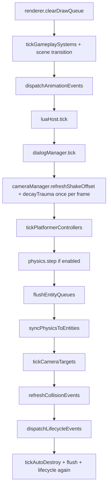

# Fixed-step contract (ArtCade V2 runtime)

Canonical order of operations for **one simulation step** in PLAY mode. Source of truth: `Application::tickFixedStep` in [`runtime-cpp/src/app/src/app_loop.cpp`](../runtime-cpp/src/app/src/app_loop.cpp).

Related: [`PHYSICS_OPTIONAL_INTEGRATION_PLAN.md`](PHYSICS_OPTIONAL_INTEGRATION_PLAN.md) (`physicsMode`), [`ARCHITETTURA_TECNICA_ENGINE_2D.md`](ARCHITETTURA_TECNICA_ENGINE_2D.md) §9 (high-level pipeline).

---

## Order within `tickFixedStep(dt)`

| Step | What runs | Notes |
|------|-----------|--------|
| 1 | `renderer->clearDrawQueue()` | Only last tick’s draw commands render (avoids ghost sprites). |
| 2 | Time / tween / sprite / layer managers, **`cameraManager->updateMotion`**, event bus | |
| 3 | **`world->tickGameplaySystems(dt)`** | Top-down, linear mover, magnet, horde, health; **not** platformer or sensor edges. |
| 4 | `entityGateway->tickSceneTransition(dt)` | |
| 5 | `gameAPI->dispatchAnimationEvents()` | |
| 6 | **`luaHost->tick(dt)`** | Logic Board `tick(dt)`, `movement.*` / `platformer.*` intent APIs. |
| 7 | **`dialogManager->tick(dt)`** | Dialog typewriter / choices; `emitDeferred` from dialog nodes flushed at end of step. Skipped when inactive. |
| 8 | *(moved)* | **`camera.shake`** only adds trauma during Lua; **`refreshShakeOffset` + `decayTrauma`** run once per render frame in `loopIteration()` (after all fixed steps) so catch-up steps do not drain shake early. |
| 9 | **`world->tickPlatformerControllers(dt)`** | Solid AABB grounding + kinematic move (before `physics.step`). **Skipped when `dialogManager->isBlocking()`.** |
| 10 | **`physics->step(dt)`** | Skipped when `physicsMode` is `off`; in `auto` only if bodies exist. |
| 11 | `world->flushEntityQueues()` | Destroys queued from Lua before sync. |
| 12 | **`world->syncPhysicsToEntities()`** | Physics body → `Transform` for simulated bodies (see table below). |
| 13 | `world->tickCameraTargets(dt)` | |
| 14 | **`world->refreshCollisionEvents()`** | Rebuilds `CollisionWorld` and computes native enter/stay/exit events after physics + sync. Lua/Logic Board reads these events on the next fixed tick. |
| 15 | `dispatchLifecycleEvents()` | Spawn/destroy handlers. |
| 16 | `tickAutoDestroy` + flush + lifecycle again | |
| — | `eventBus->flushDeferred()` | End of step (dialog `emitEvent` + other deferred). |

**Input:** `input->poll()` runs at the start of `loopIteration()`, before the fixed-step accumulator drains.

---

## Who writes `Transform` vs physics body

| Entity profile | Authority during PLAY | After `physics.step` |
|----------------|----------------------|-------------------------|
| **Platformer** (no body or kinematic follower) | `World` integrates `Transform`, **surface-face** resolve on **solid** (bottom + sides with vertical overlap; no block when fully above/below), **floor-snaps** feet via top probe; **oneWay** uses top-edge probe + pass-through when `vy < 0`; optional kinematic body follows transform | `syncPhysicsToEntities` **skips** platformer entities; world gravity **off** on platformer bodies (`gravityScale = 0`) |
| **Top-down** + Dynamic collider | `World` sets `linearVelocity`; physics step integrates | Sync copies body → `Transform` |
| **Top-down** without body | `World` integrates `Transform` directly | N/A |
| **Linear mover / horde** (no platformer/top-down) | Velocity via `applySteeringVelocity` | Sync if body exists |
| **Lua `entity.setPosition`** | Immediate gateway write; may fight physics same frame | Use sparingly during PLAY |

Top-down bodies get **`gravityScale = 0`** at creation via [`physics-body-rules`](../runtime-cpp/src/modules/runtime-entity-gateway/include/physics-body-rules.h) (world gravity does not pull them on Y).

---

## Lua intent latency

`movement.setIntent` / `platformer.requestJump` called from Lua during **`luaHost->tick`** apply in the **same** fixed step (platformer runs right after Lua, before physics).

Event-first handlers (`input.onPressed`, `lifecycle.onSpawn`, …) registered in `_logic_init()` follow the dispatch order of their respective `gameAPI->dispatch*` calls.

---

## physicsMode

| Mode | `physics->step` | Typical project |
|------|-----------------|-----------------|
| `off` | Never | Arcade template, platformer without player collider |
| `auto` | When `Physics::hasActiveBodies()` | Mixed scenes |
| `on` | Always | Top-down with dynamic bodies, physics puzzles |

See [`PHYSICS_OPTIONAL_INTEGRATION_PLAN.md`](PHYSICS_OPTIONAL_INTEGRATION_PLAN.md) for editor wiring and templates.

---

## Collision system contract

[`CollisionWorld`](../runtime-cpp/src/modules/collision/include/collision_world.h) is the runtime authority for gameplay collision queries, platformer resolution, tilemap collision, debug overlay, and Logic Board collision events. It uses [`collision_math.h`](../runtime-cpp/src/modules/collision/include/collision_math.h) for rectangle/circle/capsule/convex polygon overlap, raycast, and sweep/CCD helpers.

| Feature | Source |
|---------|--------|
| Entity collision | `CollisionBody` + resolved `CollisionShape` profiles |
| Tilemap collision | Tile palette collision profiles, aggregated into maximal rectangles when shapes are equivalent full-cell rectangles |
| Platformer ground/walls/one-way | Kinematic sweep + `CollisionWorld` solid shapes |
| Ladders/zones/pickups/hazards | `response=sensor` shapes with `role=interaction/hitbox/hurtbox` |
| Dynamic arcade bodies | `PhysicsComponent` velocity/mass state, resolved against `CollisionWorld` data |

Lua/Logic Board collision API:

| API | Notes |
|-----|-------|
| `collision.overlap(id1, id2)` | Pair overlap through `CollisionWorld`. |
| `collision.firstTouching(id, filter?)` | First touching entity matching `layer`, `role`, `response`, `tag`, or `className`. |
| `collision.raycast(x1, y1, x2, y2, filter?)` | Raycast against solid collision shapes. |
| `collision.isGrounded(id)` | Feet/body probe against solid collision shapes. |
| `collision.hasEvent(id, kind, filter?)` | Native enter/stay/exit gate. |
| `collision.events(id, kind, filter?)` | Current event records normalized so queried id is `self`. |
