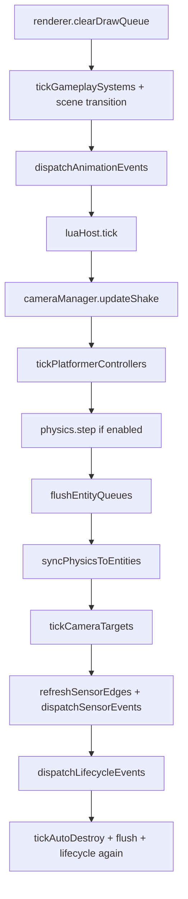

# Fixed-step contract (ArtCade V2 runtime)

Canonical order of operations for **one simulation step** in PLAY mode. Source of truth: `Application::tickFixedStep` in [`runtime-cpp/src/app/src/app.cpp`](../runtime-cpp/src/app/src/app.cpp).

Related: [`PHYSICS_OPTIONAL_INTEGRATION_PLAN.md`](PHYSICS_OPTIONAL_INTEGRATION_PLAN.md) (`physicsMode`), [`ARCHITETTURA_TECNICA_ENGINE_2D.md`](ARCHITETTURA_TECNICA_ENGINE_2D.md) §9 (high-level pipeline).

---

## Order within `tickFixedStep(dt)`

| Step | What runs | Notes |
|------|-----------|--------|
| 1 | `renderer->clearDrawQueue()` | Only last tick’s draw commands render (avoids ghost sprites). |
| 2 | Time / tween / sprite / layer managers, **`cameraManager->updateMotion`**, event bus | |
| 3 | **`world->tickGameplaySystems(dt)`** | Top-down, linear mover, magnet, horde, health; **not** platformer or sensor edges. |
| 4 | `entityGateway->tickSceneTransition(dt)` | |
| 5 | `gameAPI->dispatchAnimationEvents()` | |
| 6 | **`luaHost->tick(dt)`** | Logic Board `tick(dt)`, `movement.*` / `platformer.*` intent APIs. |
| 7 | **`cameraManager->updateShake(dt)`** | Trauma decay + shake offset for render (after Lua `camera.shake`). |
| 8 | **`world->tickPlatformerControllers(dt)`** | Solid AABB grounding + kinematic move (before `physics.step`). |
| 9 | **`physics->step(dt)`** | Skipped when `physicsMode` is `off`; in `auto` only if bodies exist. |
| 10 | `world->flushEntityQueues()` | Destroys queued from Lua before sync. |
| 11 | **`world->syncPhysicsToEntities()`** | Physics body → `Transform` for simulated bodies (see table below). |
| 12 | `world->tickCameraTargets(dt)` | |
| 13 | **`world->refreshSensorEdges()`** + `dispatchSensorEvents()` | After physics + sync (same-frame overlap). |
| 14 | `dispatchLifecycleEvents()` | Spawn/destroy handlers. |
| 15 | `tickAutoDestroy` + flush + lifecycle again | |

**Input:** `input->poll()` runs at the start of `loopIteration()`, before the fixed-step accumulator drains.

---

## Who writes `Transform` vs physics body

| Entity profile | Authority during PLAY | After `physics.step` |
|----------------|----------------------|-------------------------|
| **Platformer** (no body or kinematic follower) | `World` integrates `Transform`, **surface-face** resolve on **solid** (bottom + sides with vertical overlap; no block when fully above/below), **floor-snaps** feet via top probe; **oneWay** uses top-edge probe + pass-through when `vy < 0`; optional kinematic body follows transform | `syncPhysicsToEntities` **skips** platformer entities; world gravity **off** on platformer bodies (`gravityScale = 0`) |
| **Top-down** + Dynamic collider | `World` sets `linearVelocity`; physics step integrates | Sync copies body → `Transform` |
| **Top-down** without body | `World` integrates `Transform` directly | N/A |
| **Linear mover / horde** (no platformer/top-down) | Velocity via `applySteeringVelocity` | Sync if body exists |
| **Lua `entity.setPosition`** | Immediate gateway write; may fight physics same frame | Use sparingly during PLAY |

Top-down bodies get **`gravityScale = 0`** at creation via [`physics-body-rules`](../runtime-cpp/src/modules/runtime-entity-gateway/include/physics-body-rules.h) (world gravity does not pull them on Y).

---

## Lua intent latency

`movement.setIntent` / `platformer.requestJump` called from Lua during **`luaHost->tick`** apply in the **same** fixed step (platformer runs right after Lua, before physics).

Event-first handlers (`input.onPressed`, `lifecycle.onSpawn`, …) registered in `_logic_init()` follow the dispatch order of their respective `gameAPI->dispatch*` calls.

---

## physicsMode

| Mode | `physics->step` | Typical project |
|------|-----------------|-----------------|
| `off` | Never | Arcade template, platformer without player collider |
| `auto` | When `Physics::hasActiveBodies()` | Mixed scenes |
| `on` | Always | Top-down with dynamic bodies, physics puzzles |

See [`PHYSICS_OPTIONAL_INTEGRATION_PLAN.md`](PHYSICS_OPTIONAL_INTEGRATION_PLAN.md) for editor wiring and templates.

---

## Dual collision layers (post–custom physics refactor)

Two cooperating systems share [`collision_math.h`](../runtime-cpp/src/modules/collision/include/collision_math.h):

| Layer | Module | When it runs | Terrain / solids |
|-------|--------|--------------|------------------|
| **World platformer** | `world_grounding.cpp` | Step 8, before `physics.step` | Solid entities + **tile grid AABB** (no physics bodies required) |
| **Physics solver** | `physics.cpp` | Step 9 | Dynamic vs static/kinematic bodies; **tile static bodies** only when `Physics::hasDynamicBodies()` |

**Tilemap physics bodies:** `World::rebuildTilemapPhysics()` creates merged horizontal static rectangles (one body per solid run per row) only if at least one **Dynamic** body exists. `World::syncTilemapPhysicsWithDynamics()` also runs when the gateway creates or destroys a physics body (e.g. Lua spawn of the first Dynamic mid-scene). Platformer-only scenes use the tile grid for grounding and `isSpaceFree`; `collision.*` against tile terrain in those projects requires a Dynamic body or explicit static colliders.

**Entity-vs-entity Lua (`collision.overlap`, `collision.touchingClass`, `collision.firstTouching`):** Implemented in [`entity_collision_query.h`](../runtime-cpp/src/modules/collision/include/entity_collision_query.h) from **Transform + collider** (default 32×scale when no explicit collider). **Does not require** physics bodies or `physics.step`. Same kernel as World platformer AABB. `collision.raycast` still uses physics bodies.

| Feature | Layer |
|---------|--------|
| Pickup / While touching class | `collision.touchingClass` → geometric query |
| Destroy Other on Enter | `collision.firstTouching` + compiler sets `other` |
| Dynamic crates / impulses | Physics solver + bodies |
| Platformer ground | World tile grid + Solid AABB |

**Platformer + collider:** Transform is owned by World; optional kinematic body follows transform each tick. `syncPhysicsToEntities` does not overwrite platformer transforms.
