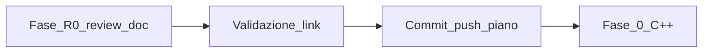
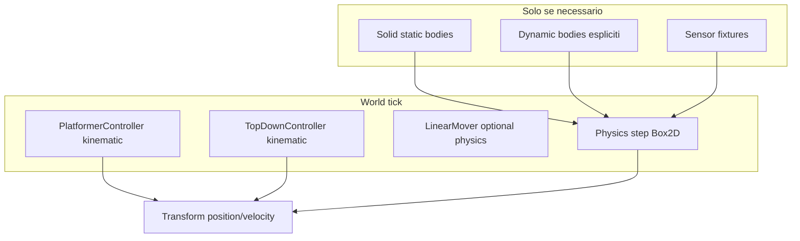

# Piano di integrazione — Physics opzionale e movimento kinematico

> **Versione**: 1.2  
> **Data**: 2026-05-25  
> **Status**: Fase 4 chiusa — inspector Physics esplicito; Fase 5 (docs) non iniziata  
> **Audience**: C++ / Editor / Product  
> **Collegamenti**: `GLOBAL_LOGIC_UI_ARCHITECTURE.md`, `ARTIST_FRIENDLY_COMPONENTS.md`, `ARCHITETTURA_TECNICA_ENGINE_2D.md` §9, `ENGINE_INTEGRATION_ROADMAP.md` (tracker engine separato)

---

## 1. Obiettivo prodotto

Permettere due famiglie di giochi nello stesso engine **senza costo mentale né runtime inutile**:

| Famiglia | Esempi | Cosa serve |
|--------|--------|------------|
| **Arcade / scriptato** | Flappy Bird, puzzle, shmup a griglia, UI-heavy | Transform + input + timer; **nessun** `physics.step` se non serve |
| **Fisico / level-based** | Platformer, puzzle con gravità reale, oggetti che cadono | Box2D su entità/solidi che lo richiedono |

Principi:

1. **Platformer Controller** = gravità e salto **scriptati** su `Transform` (`customGravity`, `jumpForce`, `maxSpeed`). Unica fonte di verità per posizione/velocità gameplay.
2. **Physics (Box2D)** = **componente esplicito** per collisioni, sensori, pile, oggetti che cadono — **non** guida il movimento del platformer.
3. **Mondo** = `physics.step` e sensor refresh **solo se** esistono corpi/fixture attivi (o flag progetto `physicsMode`, vedi §5.1).

### Regola nativa (pre-release, nessun adattamento legacy)

| Sistema | Fonte di verità | Ruolo Box2D |
|---------|-----------------|-------------|
| Platformer | `Transform` + `platformerRt_.velocity` | Collider **kinematic** opzionale (overlap / `onCollision`); posizione **push** da transform, mai pull in `syncPhysicsToEntities` |
| TopDown | `Transform` o body kinematic (stesso pattern) | Opzionale |
| Oggetti fisici (crate, pile) | Body dynamic/kinematic | Box2D guida posizione → `syncPhysicsToEntities` |

---

## 3. Definition of done — patto operativo

Allineato a [`ASSETS_ROADMAP.md`](ASSETS_ROADMAP.md) (punti 7–8), adattato a **questo piano**:

| # | Criterio |
|---|----------|
| 1 | Review interna del testo del piano completata; findings risolti o annotati in **Closure log (Fase R0)** |
| 2 | Ogni affermazione su stato attuale (§2) verificata contro i file citati su `main` |
| 3 | Nessun conflitto con `ENGINE_INTEGRATION_ROADMAP.md`, `GLOBAL_LOGIC_UI_ARCHITECTURE.md`, `LOGIC_BOARD_SPEC.md` |
| 4 | Indice [`README.md`](README.md) coerente |
| 5 | **Solo dopo review:** commit + push del solo documento piano |
| 6 | **Fasi 0–5 (C++)** non iniziano finché Fase R0 non è chiusa e il piano è su `origin/main` |

Ogni **fase di implementazione C++** (0–5) userà in aggiunta il patto completo ASSETS: `tsc`, Vitest, `cargo test`, smoke manuale, review del diff codice, commit separato.

---

## 4. Fase R0 — Review documento piano

**Obiettivo:** evitare che il piano guidi implementazione errata (file, API, ordine fasi, stato repo).

**Scope:** solo questo file + indice `docs/README.md`. **Non** include review retroattiva del codice già su `main` (web export, Logic Board trigger, ecc.).

### Checklist review

| Area | Verifica |
|------|----------|
| **Accuratezza §2** | `ensurePhysicsBody` crea body se collider esplicito **oppure** `platformerController` \| `topDownController` \| `solid` \| `sensor` — confermato in `runtime-entity-gateway.cpp` |
| **Platformer oggi** | `tickPlatformerControllers` ritorna se `physicsHandle == 0`; gravità = `customGravity * dt` — `world_movement.cpp` |
| **Top-down pattern** | Fallback transform senza handle — `tickTopDownControllers` |
| **Step mondo** | `physics->step(dt)` ogni fixed step — `app.cpp` |
| **Parametri editor** | Default platformer: `maxSpeed` 300, `jumpForce` 600, `customGravity` 1500 — `component-registry.ts` |
| **Logic Board** | Trigger in `schemas/logic-board/index.json` includono `onCollisionEnter` / `onCollisionExit` |
| **Roadmap** | Tracker engine resta in `ENGINE_INTEGRATION_ROADMAP.md`; implementazione physics → **questo file** |
| **Scope / promesse** | §10 fuori scope; nessuna feature C++ descritta come già presente |

### Gate



**Output:** [Closure log (Fase R0)](#closure-log-fase-r0) in fondo al documento.

---

## 5. Stato attuale (baseline)

### 5.1 Cosa è già opt-in per entità

- `EntityDef.physics` è **opzionale**; `createEntityDef` non aggiunge physics.
- `RuntimeEntityGateway::ensurePhysicsBody` crea un body **solo se**:
  - collider physics esplicito (`collider.size` > soglia), **oppure**
  - `platformerController` | `topDownController` | `solid` | `sensor`.

Riferimento: `runtime-cpp/src/modules/runtime-entity-gateway/src/runtime-entity-gateway.cpp` (`ensurePhysicsBody`).

### 5.2 Cosa resta sempre “acceso”

- `Application::tickFixedStep` chiama **`physics->step(dt)`** ogni frame (`app.cpp`).
- Mondo Box2D con gravità default `(0, 10)` anche a zero corpi (`physics.cpp`).
- `World::tickPlatformerControllers` **esce subito** se `physicsHandle == 0` — il platformer **non funziona** senza body.
- Grounded platformer: `physics_.areOverlapping` vs `Solid` / `groundClass` — richiede corpi su player e terreno.

### 5.3 Cosa è già kinematico (logica)

- Gravità verticale platformer: `vy += customGravity * dt` in `world_movement.cpp` (non gravità mondo Box2D).
- Parametri editor: `maxSpeed`, `jumpForce`, `customGravity`, `coyoteTime`, `jumpBuffer` (`PlatformerControllerComponent`).

### 5.4 Pattern di riferimento nel codebase

- **TopDownController**: se **nessun** physics handle → aggiorna **Transform** direttamente (`world_movement.cpp`, ramo `handle == 0`).
- Obiettivo: stesso pattern per **PlatformerController**.

### 5.5 Logic Board / Lua

- `onCollision*` → `collision.touchingClass` (overlap Box2D) o edge sintetizzato in Lua.
- `onTriggerEnter/Exit` → `sensor.*` (fixture Box2D + `dispatchSensorEvents`).
- Giochi senza physics: preferire `onUpdate`, `onInput`, distanza manuale, `event.emit`, o sensor **solo dove serve**.

---

## 6. Architettura target



### 6.1 Livelli di abilitazione

| Livello | Campo / regola | Effetto |
|---------|----------------|---------|
| **Progetto / scena** | `world.physicsMode` (default `auto`, proposta §7.1) | `auto` = step solo se `physics.hasActiveBodies()` |
| **Entità — Physics** | `physics?: PhysicsComponent` | Collider + bodyType espliciti → body Box2D |
| **Entità — Platformer** | `platformerController` | Movimento scriptato; grounded configurabile |
| **Entità — Solid** | `solid` | Richiede Physics static (shortcut o componente separato) |
| **Entità — Sensor** | `sensor` | Richiede fixture sensor (static); opzionale world physics |

### 6.2 Platformer “puro” (target)

| Aspetto | Comportamento |
|---------|----------------|
| Gravità | `customGravity` px/s² (es. 800–2000), slider editor |
| Salto | `jumpForce` come impulso su `vy` |
| Orizzontale | `maxSpeed` × asse input |
| Feel | coyote + jump buffer (invariati) |
| Posizione | Scrittura su **Transform** (+ sync opzionale a body kinematic se presente) |
| Grounded | **Fase A**: overlap Box2D (compat). **Fase B**: raycast/AABB vs solid layer o tilemap |

### 6.3 Physics “pesante” (opt-in)

- Oggetti che cadono, stack, impulsi realistici → `PhysicsComponent` dynamic + `physics.applyImpulse` da Lua.
- Terreno → `Solid` + body **static** (non dynamic).
- Nessun platformer player **dynamic** obbligatorio.

---

## 7. Fasi di implementazione (C++)

> Prossimo consigliato: **Fase 3** (step condizionale), poi Fase 4 (inspector Physics) e Fase 5 (docs).

### Fase 0 — Allineamento e guardrail (1–2 giorni) ✅

**Obiettivo**: documentazione + test baseline senza cambiare comportamento default.

| Task | Output |
|------|--------|
| Accettare questo piano in review team | OK (R0 + commit piano su `main`) |
| Test C++ esistenti su `world_movement`, gateway physics | Verde + 4 test baseline aggiunti |
| Snapshot progetto demo: platformer con/senza `physics` su player | `runtime-cpp/test-project/fixtures/physics-baseline/` |

**DoD**: nessuna regressione; elenco scenari manuali (vedi §11).

**Test baseline aggiunti** (da aggiornare in Fase 1):

- `world-intent-test`: body implicito con solo `platformerController`; early-return movimento senza handle; `isGrounded` false senza handle.
- `entity-signals-test`: `platformerController` → `ensurePhysicsBody` crea handle.

---

### Fase 1 — Platformer kinematic senza body obbligatorio (3–5 giorni) ✅

**Obiettivo**: `PlatformerController` integra sempre su `Transform`; collider Physics opzionale solo per overlap.

| Area | Modifica |
|------|----------|
| `world_movement.cpp` | Integrazione `vx`/`vy` su `Transform`; push posizione/velocità al body se presente |
| `world.cpp` | `syncPhysicsToEntities` salta entità con platformer (transform resta autoritativo) |
| `ensurePhysicsBody` | Nessun body solo per `platformerController`; platformer + collider esplicito → **Kinematic** |
| Editor | Tooltip: movimento su transform; Physics opzionale per collisioni |
| Lua API | `platformer.isGrounded` / `requestJump` invariati |

**DoD**:

- Player solo `platformerController` + sprite: salto e caduta visibili senza `physics` su player.
- Test unitario C++: platformer senza handle aggiorna transform Y con `customGravity`.

---

### Fase 2 — Grounded senza overlap (opzionale ma consigliata) (3–4 giorni) ✅

**Obiettivo**: terra rilevabile senza Physics sul player (usa componente **Solid** esistente).

| Opzione | Descrizione | Complessità |
|---------|-------------|-------------|
| **2a — Raycast down** | `collision.raycast` o helper `platformer.probeGround` da transform | Media |
| **2b — AABB vs Solid registry** | Solid come dati + hit test AABB (no step) | Media-alta |
| **2c — Tilemap layer** | Ground layer da tilemap (futuro) | Alta |

**Raccomandazione**: **2a** per MVP fase 2; overlap Box2D opzionale se player ha collider kinematic.

**DoD**: livello con solo `Solid` static + player kinematic: `isGrounded` true sul pavimento.

---

### Fase 3 — Physics world condizionale (2–3 giorni) ✅

**Obiettivo**: non pagare `physics->step` in giochi tipo Flappy Bird.

| Area | Modifica |
|------|----------|
| `Physics` | `bool hasActiveBodies() const` |
| `app.cpp` | `if (physics->hasActiveBodies()) { step; refreshSensorEdges; dispatchSensor }` |
| `ProjectDoc` / scene | `world.physicsMode: 'off' \| 'auto' \| 'on'` (default `auto`) |
| Editor | World settings panel: “Physics simulation” (Auto / On / Off) |

**DoD**: scena zero corpi + zero sensor → profiler non registra tempo physics step; Flappy-like a 60 FPS stabile.

---

### Fase 4 — Componente Physics esplicito in editor (2–3 giorni) ✅

**Obiettivo**: UX chiara “aggiungi fisica”.

| Area | Modifica |
|------|----------|
| Inspector | Blocco **Physics** come Sensor/Solid (bodyType, collider shape/size) |
| `ensurePhysicsBody` | Body **solo** con `physics` esplicito OR `solid` OR `sensor` (platformer/topDown **non** implicano body) |

**DoD**: nuova entità + platformer: nessun body finché non si aggiunge Physics (collider) o Solid al terreno.

---

### Fase 5 — Logic Board e documentazione (1–2 giorni)

| Task | Output |
|------|--------|
| Aggiornare `GLOBAL_LOGIC_UI_ARCHITECTURE.md` | Platformer kinematic vs Box2D |
| Capability matrix | `onCollision*` richiede overlap; suggerire alternative in UI |
| Template progetto | “Arcade (no physics)” vs “Platformer” |

---

## 8. Modello dati (proposta)

### 8.1 `WorldSettings` (editor + C++)

```ts
// editor/src/types/index.ts (proposta)
export type PhysicsMode = 'off' | 'auto' | 'on'

export interface WorldSettings {
  gravity: number           // usato solo se physics ON e applicato a mondo
  pixelsPerMeter: number
  timeScale: number
  physicsMode?: PhysicsMode // default 'auto'
}
```

### 8.2 `PlatformerControllerComponent` (invariato + opzionale)

Campi attuali restano la **fonte di verità** per feel arcade. Opzionale futuro:

- `groundProbe: 'overlap' | 'raycast' | 'none'` (default `overlap` in Fase 1–2).

### 8.3 `PhysicsComponent`

Resta collider + `bodyType`. Documentare: **non necessario** per platformer kinematic.

---

## 9. Matrice componenti → Box2D

| Componente | Body Box2D | Step mondo | Note |
|------------|------------|------------|------|
| Sprite only | No | No | Transform + render |
| Platformer (target Fase 1+) | No | No | Kinematic scriptato |
| TopDown | No (preferito) | No | Già supportato senza handle |
| LinearMover | Opzionale | Se body | Può usare transform fallback |
| Solid | Static | Se presente | Terreno |
| Sensor | Static sensor | Se presente | Trigger zone |
| Physics explicit (no platformer) | Dynamic/Kinematic/Static | Sì | Puzzle, pile, realism |
| Physics + Platformer | Kinematic | Se collider esplicito | Solo overlap / collisioni; movimento da transform |

---

## 10. Rischi e mitigazioni

| Rischio | Mitigazione |
|---------|-------------|
| Grounded senza collider player | ✅ AABB vs entità **Solid** (`isGroundedOnSolidAabb`) |
| Logic Board `onCollision` senza Physics sul player | Doc + warning; sensor/message per arcade puro |
| Doppia fonte posizione | Platformer: transform autoritativo, body segue; altri: body → transform in sync |
| Sensor senza step | `physicsMode: on` forza step; oppure sensor AABB futuro (out of scope) |
| WASM performance | Fase 3 misura con profiler esistente |

---

## 11. Piano test

### Automatici

- C++: `world_movement` test platformer senza handle (Y aumenta con gravity, salto riduce vy).
- C++: `hasActiveBodies` false → step skipped (mock o integrazione leggera).
- Editor: Vitest su serializzazione `physicsMode`.

### Manuali (checklist)

- [ ] Nuovo progetto “Flappy”: bird con platformer o solo transform; tubi static senza dynamic; nessuna finestra physics.
- [ ] Platformer classico: player kinematic + solid static; salto/coyote OK.
- [ ] BUILD WEB + PLAY: stesso comportamento native/WASM.
- [ ] Logic Board: regola `onUpdate` + `setPosition` senza collision.

---

## 12. Ordine di merge consigliato

1. **Fase 1** (platformer kinematic) — valore immediato, rischio medio.  
2. **Fase 3** (step condizionale) — Flappy / arcade performance.  
3. **Fase 2** (grounded raycast) — qualità platformer senza dynamic player.  
4. **Fase 4** (inspector Physics) — chiarezza prodotto.  
5. **Fase 5** (docs Logic Board).

Ogni fase = PR separato reviewabile (~300–800 LOC ciascuno).

---

## 13. Fuori scope (v2+)

- Physics 2.0 / continuous collision custom senza Box2D.
- Tilemap collision senza solid entities.
- Networked physics.
- `onCollision` edge nativo C++ (oggi edge Lua da `touchingClass`).

---

## 14. Riferimenti codice

| Argomento | File |
|-----------|------|
| Platformer tick | `runtime-cpp/src/world/src/world_movement.cpp` |
| Body creation rules | `runtime-cpp/.../runtime-entity-gateway.cpp` `ensurePhysicsBody` |
| Physics step | `runtime-cpp/src/app/src/app.cpp` `tickFixedStep` |
| Top-down fallback | `world_movement.cpp` `tickTopDownControllers` |
| TS component defs | `editor/src/types/components.ts` |
| Inspector defaults | `editor/src/panels/inspector/component-registry.ts` |
| Game loop doc | `docs/ARCHITECTURE_INTEGRATION.md` |

---

## 15. Criteri di successo (release implementazione)

1. Template **“Arcade — no physics”** esegue preview senza `physics->step` misurabile quando nessun solid/sensor.
2. Template **“Platformer”** usa `customGravity` / `jumpForce` configurabili; player **non** richiede `PhysicsComponent`.
3. Documentazione artista: “Quando aggiungere Physics” in `ARTIST_FRIENDLY_COMPONENTS` o addendum a questo piano.
4. `test-project` e fixture `physics-baseline` passano smoke platformer + optional Physics collider.

---

## Closure log (Fase R0)

| Campo | Valore |
|-------|--------|
| **Data** | 2026-05-25 |
| **Scope** | Solo documento piano + `docs/README.md` |
| **Esito** | Chiusa — pronto per commit |

### Findings e fix applicati al documento

1. **Naming:** allineato `world.physicsEnabled` → `world.physicsMode` in §6.1 (coerente con §8.1 e Fase 3).
2. **Roadmap:** aggiunto cross-link a `ENGINE_INTEGRATION_ROADMAP.md` in header; chiarito che il tracker engine non si duplica qui.
3. **Numerazione:** inseriti §3 (patto), §4 (Fase R0); sezioni successive rinumerate (5–15).
4. **Gate:** Fasi 0–5 marcate bloccate fino a commit piano; diagramma R0 → validazione → push → Fase 0.
5. **Verifica §2:** affermazioni su `ensurePhysicsBody`, platformer early-return, top-down fallback, `physics->step`, default inspector — confermate su `main` al 2026-05-25.
6. **Logic Board:** elenco trigger include `onCollisionEnter` / `onCollisionExit` — allineato a `index.json`.

### Follow-up (non in Fase R0)

- ~~Implementazione C++: avviare da Fase 0 dopo push.~~ → Fase 0 chiusa; Fase 1 next.
- `GLOBAL_LOGIC_UI_ARCHITECTURE.md`: aggiornare in Fase 5 quando il platformer kinematic sarà codificato.

---

## Closure log (Fase 0)

| Campo | Valore |
|-------|--------|
| **Data** | 2026-05-25 |
| **Scope** | Test C++ baseline + fixture `test-project`; nessun cambio comportamento runtime |
| **Esito** | Chiusa |

### Deliverable

1. `runtime-cpp/tests/world-intent-test.cpp` — 3 test `test_baseline_*` (body implicito, skip movimento senza handle, grounded false senza handle).
2. `runtime-cpp/tests/entity-signals-test.cpp` — `test_baseline_platformer_controller_creates_physics_body`.
3. `runtime-cpp/test-project/fixtures/physics-baseline/` — JSON player con/senza blocco `physics` + README smoke.
4. `ctest`: `world_intent_test`, `entity_signals_test`, `physics_test` verdi (Release).

### Review

- Nessuna modifica a `world_movement.cpp` / `ensurePhysicsBody` (comportamento invariato).
- I test baseline documentano il gap Fase 1: platformer senza handle non integra transform.
- Checklist manuale §11 resta per smoke editor/Tauri (non eseguita in CI doc-only).

---

## Closure log (Fase 1)

| Campo | Valore |
|-------|--------|
| **Data** | 2026-05-25 |
| **Scope** | `world_movement`, `ensurePhysicsBody`, editor inspector, test C++ |
| **Esito** | Chiusa |

### Deliverable

1. `tickPlatformerControllers`: ramo kinematic su `Transform` quando `physicsHandle == 0` (`platformerRt_.velocity`).
2. `ensurePhysicsBody`: niente body solo per `platformerController` (resta con `physics` esplicito, solid, sensor, topDown).
3. Inspector: `description` su Platformer + campo `groundClass`.
4. Test: `test_platformer_kinematic_falls_with_custom_gravity`, no implicit body, movimento orizzontale kinematic.

### Modello nativo (v1.2)

- Un solo percorso platformer: integrazione su `Transform`, push a body kinematic se presente.
- `syncPhysicsToEntities` non sovrascrive transform su entità con `platformerController`.
- `ensurePhysicsBody`: platformer + collider esplicito → `BodyType::Kinematic`.

### Follow-up

- ~~Fase 2: raycast / AABB per grounded senza collider sul player.~~ → Fase 2 chiusa (AABB Solid).

---

## Closure log (Fase 2)

| Campo | Valore |
|-------|--------|
| **Data** | 2026-05-25 |
| **Scope** | `isGroundedOnSolidAabb`, helper AABB in `world_internal.h` |
| **Esito** | Chiusa |

### Deliverable

1. Probe AABB piedi player vs top surface di ogni entità attiva con **Solid** + `groundClass` match.
2. `isGrounded`: overlap Box2D se player ha handle; altrimenti AABB Solid.
3. Test: airborne false; platformer-only su Solid scaled → grounded + jump; coyote dopo distacco.
4. Nessun nuovo componente — riusa `SolidComponent` + transform/scale per dimensioni.

### Review pre-chiusura (2026-05-25)

| Check | Esito |
|-------|--------|
| Solid esistente, nessun duplicato | OK |
| Platformer senza Physics grounded su Solid | OK (`test_platformer_grounded_on_solid_without_player_physics`) |
| Coyote + jump buffer attivi in C++ | OK (`canJump = grounded \|\| coyoteTimer > 0`) |
| Overlap path con collider kinematic player | OK |
| Regressione test C++ 18/18 | OK |

### Follow-up post-Fase 2

- Raycast down (2a) opzionale se serve probe più preciso su tilemap (fuori MVP AABB).

---

## Closure log (Fase 3)

| Campo | Valore |
|-------|--------|
| **Data** | 2026-05-25 |
| **Scope** | `Physics::hasActiveBodies`, `Application::tickFixedStep`, `world.physicsMode` editor+C++ |
| **Esito** | Chiusa |

### Deliverable

1. `physicsMode`: `off` \| `auto` (default) \| `on` in `project.json` → `ProjectDoc.world`.
2. Auto: `physics.step` + sensor edges solo se `hasActiveBodies()`.
3. Inspector → World Settings → Physics simulation.
4. Test: `physics_test` #15; Vitest `project-world.test.ts`.

### Review pre-chiusura (Fase 3)

| Check | Esito |
|-------|--------|
| `auto` + zero bodies → no `step` | OK (`physics-test` #15, `app.cpp`) |
| `on` forza step anche senza bodies | OK |
| Editor World Settings + codec default `auto` | OK |
| Sensor in `auto` con bodies da Solid | OK (fixture esistenti) |
| WASM hot-reload `physicsMode` | Da verificare in smoke §11 (reload progetto) |

---

## Closure log (Fase 4)

| Campo | Valore |
|-------|--------|
| **Data** | 2026-05-25 |
| **Scope** | Inspector Physics, `ensurePhysicsBody` senza topDown implicito |
| **Esito** | Chiusa |

### Deliverable

1. Inspector: **Physics (Box2D Body)** — bodyType, collider (shape/size/offset/density/friction/sensor).
2. Add/remove physics sulle entità; chip header + scroll.
3. Runtime: body solo con collider esplicito, **Solid**, o **Sensor** (platformer/topDown soli → no body).
4. Test: `world-intent` topDown-only; Vitest `project-physics.test.ts`.

### Review pre-chiusura (Fase 4) — commit `37ac155`

> **Processo:** questa tabella andava redatta **prima** di commit/push (patto §3). Retroattiva.

| Area | Check | Esito |
|------|--------|--------|
| **DoD piano** | Inspector Physics come Solid/Sensor | OK — `PhysicsSection.tsx`, add/remove, chip `InspectorBlockKey` |
| **DoD piano** | `ensurePhysicsBody` solo physics \| solid \| sensor | OK — rimosso gate `hasTopDown`; test `test_topdown_only_*` + fix solid+topDown |
| **Editor** | Round-trip `project.json` | OK — Vitest `project-physics.test.ts` (2/2) |
| **Editor** | Platformer hint UX | OK — descrizione registry aggiornata |
| **Runtime** | Platformer + collider esplicito → kinematic | Invariato (`hasPlatformer && hasExplicitCollider`) |
| **Runtime** | Solid/sensor senza blocco Physics in JSON | OK — body da componente gameplay (già Fase 1–2) |
| **Patto §3** | `tsc` (editor) | **Non eseguito** prima del push — da fare in Fase 5 o smoke |
| **Patto §3** | `cargo test` | **Non eseguito** prima del push |
| **Patto §3** | `ctest` su binario **ricompilato** | **Non verificato** (build MSVC fallito in agent env; ctest su artefatto precedente) — **ricompilare localmente** |
| **Patto §3** | Smoke manuale §11 | **Non eseguito** |
| **Patto §3** | Review diff **prima** di git push | **Violato** — push anticipato |
| **Processo git** | Tabella review Fase 3 nel commit Fase 4 | Accettabile ma ideale commit separato doc-only |

**Verdetto codice:** approvato per scope Fase 4; **verdetto processo:** chiusura valida solo dopo `tsc` + rebuild C++ + `ctest` locali (e smoke quando possibile).

**Ordine obbligatorio da ora (fasi 0–5):** implementazione → `tsc` + Vitest + rebuild `ctest` → **review diff in chat** → aggiornare questa sezione → **solo allora** commit + push.
