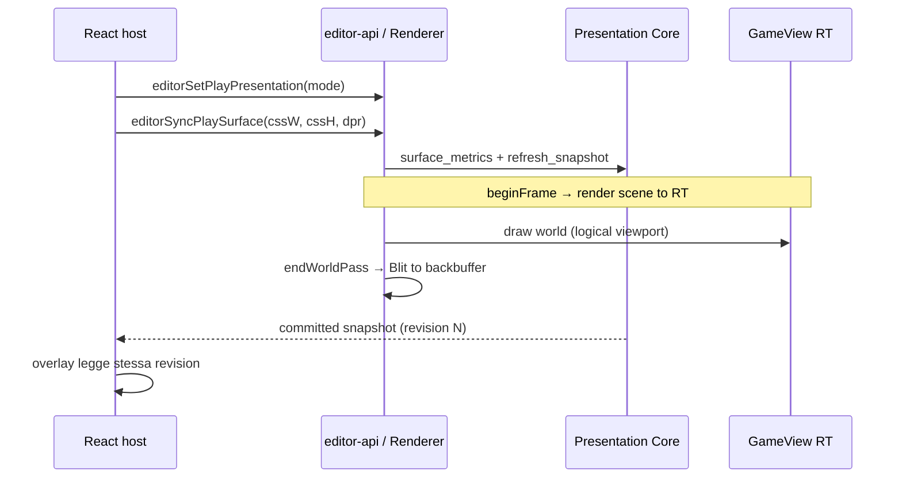

# Presentation Architecture — Report di migrazione e audit manuale

> **Audience:** collaboratori che devono fare code review / audit manuale  
> **ADR di riferimento:** [`PRESENTATION_ARCHITECTURE.md`](PRESENTATION_ARCHITECTURE.md)  
> **Stato migrazione:** fasi **1–8 completate** · fase **9 non avviata** (render graph generico — solo se servirà)  
> **Ultimo commit rilevante:** `d6a04ea7` — *Complete presentation pipeline ADR phases 7-8*  
> **Data report:** 2026-06-24

---

## 1. Executive summary

ArtCade Studio separa **cosa mostrare** (Presentation Core) da **come disegnare** (Renderer). Prima della migrazione, logica di fit/letterbox, coordinate surface↔world e policy di viewport erano duplicate tra React, `Renderer` e `CameraManager`, con drift tra preview WASM, play docked, finestra esterna e exe nativo.

La migrazione in 8 fasi ha introdotto:

1. Un **core C++ di presentazione** (policy, mapper, snapshot atomica per frame).
2. **Un solo percorso di picking** (`PresentationSnapshot::surface_to_world`).
3. **Store React** che consuma la snapshot committata (niente più “verità” parallela in TS per fit/letterbox).
4. **Viewport editor a superficie fissa** (pan/zoom come intent WASM, senza scroll DOM).
5. **Pipeline di render esplicita** a pass (fase 7).
6. **Parità play** tra embedded, finestra esterna, fullscreen e nativo (fase 8).

**Comportamento visivo atteso:** in edit mode e in play “normale” l’utente non dovrebbe notare regressioni volute; l’unico cambiamento UX intenzionale della serie è la **fase 6** (niente scroll del mondo via DOM — pan/zoom sulla superficie fissa).

---

## 2. Perché questa architettura

### 2.1 Problema di partenza

| Sintomo | Causa radice |
|--------|----------------|
| Ruler / overlay React non allineati al canvas WASM | TS e C++ calcolavano fit/scale in modo indipendente |
| Picking errato ai bordi o con letterbox | `screenToWorld` duplicato in `Renderer` e `CameraManager` |
| Play docked vs finestra preview con scale diversa | `editor_sync_play_surface` impostava il framebuffer in pixel **logici** invece che sulla **superficie host** (CSS×DPR) |
| Refactor renderer rischioso | `editorCameraActive` e branch sparsi mescolavano policy e draw |

### 2.2 Regola d’oro (ADR)

> **Presentation** descrive *cosa* è la vista (mode, surface, placement, matrici).  
> **Renderer** esegue *come* disegnare (RT, draw queue, Raylib).  
> La **snapshot** non contiene istruzioni di draw né ordine dei pass — solo stato committato per il frame *N*.

### 2.3 Catena delle coordinate

```
DOM / CSS surface
      ↓ devicePixelRatio
Framebuffer (GPU / canvas backing store)
      ↓ output policy (fit, integer scale, letterbox)
Logical viewport (SceneDef.viewportSize)
      ↓ camera (EditorCamera o GameCamera)
World
```

Ogni conversione deve dichiarare esplicitamente spazio di partenza e arrivo. Vedi ADR § *Coordinate spaces*.

---

## 3. Cronologia commit (fasi 1–8)

| Fase | Commit | Sintesi |
|------|--------|---------|
| 1–3 | `9ac56d97` | Presentation Core: policy, mapper, snapshot, dual camera, rimozione `editorCameraActive` |
| 4 | `3ee5eb42` | Picking solo via Presentation; rimossi `screenToWorld` duplicati |
| 5 | `123a695a` | Snapshot 64-byte verso React; `usePresentationSnapshot()`; fit TS demoted |
| 6 | `e45ed413` | Superficie fissa; `editor_resize_surface` + ViewController; niente scroll spacer |
| 7 (base) | `9f9fef59` | Pass espliciti in `app/render/passes/`; `RenderPipelineBuilder` |
| 7–8 (chiusura) | `d6a04ea7` | `buildPipeline` ADR, dedupe sprite, mode-driven passes, play surface unificata, `PlayExternal`/`PlayFullscreen` |

---

## 4. Fase 7 — Pipeline a pass espliciti

### 4.1 Obiettivo ADR

> *Explicit passes: Scene, GameView, Blit, Grid, Gizmo, Debug* — cambiamento **strutturale**, non necessariamente visivo.

### 4.2 Cosa è stato fatto

#### A) Modello dati pipeline (`runtime-cpp/src/modules/renderer/`)

| Simbolo | File | Ruolo |
|---------|------|--------|
| `RenderPassId` | `include/render_pass_id.h` | Enum dei pass: `SceneBackdrop`, `Grid`, `SceneEntities`, `Gizmo`, `Debug`, `GameView`, `Blit` |
| `ViewRenderFeatures` | `include/view_render_features.h` | Flag opzionali: grid, gizmo, selection, physics debug, `drawCameraFrame` (solo React) |
| `RenderPipeline` | `include/render_pipeline.h` | `appPassOrder` + flag `captureGameView` / `blitGameView` |
| `RenderPipelineBuilder::buildPipeline` | `src/render_pipeline.cpp` | Costruisce il piano da **snapshot + features + scene attiva** |

**Perché `buildPipeline` e non solo un vettore di pass:** l’ADR mostra `buildPipeline(snapshot, features)` come API canonica. I flag GameView/Blit documentano il ciclo completo anche se l’esecuzione resta nel `Renderer` (vedi sotto).

#### B) Scheduling guidato dalla presentation mode

In `render_pipeline.cpp`, la snapshot **non è ignorata**:

- **Overlay editor** (Grid, Gizmo): solo se `effectiveMode` è `SceneEdit` o `CameraPreview`.
- **GameView + Blit**: flag attivi per `PlayEmbedded`, `PlayExternal`, `PlayFullscreen`.

Questo evita di mostrare gizmo in play e allinea il piano render alla modalità committata.

#### C) Pass applicativi (`runtime-cpp/src/app/render/passes/`)

| Pass | File | Contenuto |
|------|------|-----------|
| SceneBackdrop | `scene_background_pass.cpp` | Sfondo scena, parallax |
| Grid | `grid_pass.cpp` | Griglia editor |
| SceneEntities | `scene_entities_pass.cpp` | Entità, tilemap, testo |
| Gizmo | `gizmo_pass.cpp` | Selezione / handle |
| Debug | `debug_pass.cpp` | Physics debug (WASM play) |

**Perché sotto `app/render/` e non `renderer/passes/`:** i pass Grid/Gizmo/Debug sono overlay **editor/game app**, non primitivi del modulo renderer. Il modulo renderer espone solo infrastruttura (es. `BlitPass` in `renderer/src/passes/blit_pass.cpp`).

#### D) Orchestrazione frame (`app_scene_render.cpp`)

Flusso per frame:

```
committedPresentationSnapshot()
        ↓
buildPipeline(snapshot, features, hasScene) → appPassOrder
        ↓
beginFrame()          ← GameView RT capture (se compositor attivo)
        ↓
for (pass in appPassOrder) → switch → execute_*_pass()
        ↓
endWorldPass()        ← Blit GameView → backbuffer (se compositor)
        ↓
endScreenPass() / presentScreen()
```

`GameView` e `Blit` nell’enum hanno `case` vuoti nel loop app: **sono eseguiti dentro** `Renderer::beginFrame` / `Renderer::endWorldPass` — scelta intenzionale per non duplicare il lifecycle Raylib/Emscripten.

#### E) Dedupe risoluzione sprite (`sprite_frame_resolve`)

Prima, `resolveSpriteFrame` era copiato in `scene_entities_pass.cpp` e `gizmo_pass.cpp`.

Ora modulo unico:

- `runtime-cpp/src/app/render/sprite_frame_resolve.h`
- `runtime-cpp/src/app/render/sprite_frame_resolve.cpp`

API: `sprite_frame_resolve()`, `sprite_frame_has_pixels()`.

**Perché:** una sola politica per “quale frame sprite disegnare” (clip corrente → defaultClip in edit → asset statico).

#### F) `drawCameraFrame` in `ViewRenderFeatures`

Presente per **parità con l’ADR**; il rettangolo camera in edit è disegnato in **React** (`PreviewPanel`), non in C++. Il builder C++ non schedula un pass dedicato — nessun debito nascosto: il flag esiste per contratto futuro / documentazione.

### 4.3 Cosa verificare in audit (fase 7)

- [ ] `buildPipeline` non schedula Grid/Gizmo in modalità play.
- [ ] `features.drawPhysicsDebug` rispettato solo dove previsto (`app_scene_render` + WASM).
- [ ] Nessun pass “fantasma”: ogni `RenderPassId` in `appPassOrder` ha `execute_*` corrispondente.
- [ ] `beginFrame`/`endWorldPass` rispettano `gameViewCompositorEnabled` coerente con `PresentationMode`.
- [ ] `sprite_frame_resolve` usato ovunque serviva risoluzione sprite (grep `resolveSpriteFrame` → deve essere zero).

### 4.4 Test automatici fase 7

| Test | Path |
|------|------|
| Pipeline builder | `runtime-cpp/tests/render_pipeline_test.cpp` |
| Presentation / camera modes | `runtime-cpp/tests/presentation-camera-modes-test.cpp` |
| Integrazione presentation | `runtime-cpp/tests/presentation-integration-test.cpp` |

---

## 5. Fase 8 — Parità play (embedded, external, fullscreen, native)

### 5.1 Obiettivo ADR

> *Same snapshot/policy for embedded play, external window, fullscreen, native exe*

Tutti i percorsi play devono:

1. Usare **GameCamera** + **output policy** del progetto.
2. Rasterizzare la scena in **GameView RT** (logical viewport).
3. Comporre sulla **superficie host** con la stessa policy (letterbox / integer fit).
4. Esporre la **stessa snapshot** a React per eventuali overlay.

### 5.2 Problema risolto

**Prima:** `editor_sync_play_surface(fbW, fbH)` impostava il backing store alla **risoluzione logica** della scena (es. 512×320). Il CSS applicava poi `transform: scale(...)` per riempire lo stage → framebuffer e area visiva non coincidevano con il modello compositor (letterbox gestito in C++).

**Dopo:** la superficie play è la **dimensione host in CSS**, moltiplicata per DPR nel core C++.

### 5.3 API C++ nuova / modificata

#### `Renderer::syncPlaySurface(cssW, cssH, devicePixelRatio)`

File: `runtime-cpp/src/modules/renderer/src/renderer.cpp`

Comportamento:

1. `fbW/H = round(css × DPR)` → `setWindowSize` se cambiato.
2. Aggiorna `PresentationState.surface` via `surface_metrics_from_css`.
3. `syncPresentationState()` → `updateCameraProjection()` → `refresh_snapshot()`.

Simmetrico concettualmente a `editorResizeSurface` (fase 6), ma **senza ViewController** — in play la camera è GameCamera, non editor pan/zoom.

#### `editor_sync_play_surface` (WASM export — **breaking change**)

| | Prima | Dopo |
|---|--------|------|
| Firma | `(int fbW, int fbH)` | `(float cssW, float cssH, float devicePixelRatio)` |
| Semantica | Pixel logici viewport | Pixel CSS area host × DPR |

Binding TS: `editor/src/utils/wasm-bridge.ts` → `editorSyncPlaySurface(cssW, cssH, dpr?)`.

#### `editor_set_play_presentation(int mode)` (WASM export — **nuovo**)

Ordinali allineati a `PresentationMode` (vedi `presentation-snapshot.ts` → `PRESENTATION_MODE_ABI`):

| Valore | Mode |
|--------|------|
| 2 | `PlayEmbedded` |
| 3 | `PlayExternal` |
| 4 | `PlayFullscreen` |

Stato WASM: `ArtCade::s_playPresentationMode` in `editor-api.cpp`, applicato su:

- `editor_set_mode(1)` (play)
- `editor_enter_play_mode`
- chiamata esplicita da React

Binding TS: `editorSetPlayPresentation('playEmbedded' | 'playExternal' | 'playFullscreen')`.

### 5.4 Percorsi React aggiornati

#### Play embedded (pannello preview docked)

File: `editor/src/panels/PreviewPanel.tsx`

- Canvas: `runtimeCanvasPlayStyle({ hostSize: playHostSize, ... })` — la canvas **riempie l’host** senza `scale()` CSS sulla logical size.
- Sync: `editorSyncPlaySurface(playHostSize.x, playHostSize.y, dpr)` quando cambia lo stage.
- Scale visiva per layout container: ancora derivata da snapshot (`playCssScaleFromSnapshot`) o fallback `playFitScale`.

#### Finestra runtime preview (Tauri)

File: `editor/src/runtime-preview/RuntimePreviewApp.tsx`

- All’avvio sessione: `editorSetPlayPresentation('playExternal')`.
- Resize / fullscreen: listener su `getCurrentWindow().onResized` + `isFullscreen()` → `playFullscreen` vs `playExternal`.
- Canvas: `runtimePreviewDisplaySize` → `hostSize` in `runtimeCanvasPlayStyle` (vedi `runtime-preview-display.ts`).

#### `runtime-sync-service`

Su `syncPlayMode(true)`: `editorSetPlayPresentation('playEmbedded')` prima di `editorSetMode(1)` — play nel main editor non eredita mode da sessione external precedente (istanze WASM separate, ma difesa esplicita).

### 5.5 Native exe

File: `runtime-cpp/src/app/src/app_project_lifecycle.cpp`

- Play: `ViewportPolicy::NativePlay` → compositor + `outputPolicy` da progetto.
- `setWindowSizeForLogicalViewport` per sizing finestra desktop.
- Fullscreen nativo: `Renderer::toggleBorderlessFullscreen()` imposta `PresentationMode::PlayFullscreen` (già presente pre-fase 8).

**Audit:** verificare che exe e WASM producano placement equivalente a parità di logical viewport, surface size e policy (test golden ADR §7).

### 5.6 Diagramma flusso play unificato



### 5.7 Cosa verificare in audit (fase 8)

- [ ] Docked play: `playHostSize` ≠ logical viewport quando c’è scale — sync deve usare **host**, non `frame.x/y` logici.
- [ ] External window: F11 fullscreen commuta `PlayFullscreen` nel WASM della finestra preview.
- [ ] DPR ≠ 1: framebuffer = round(css × dpr); picking usa snapshot aggiornata.
- [ ] Letterbox in play: disegnato dal compositor C++ (`blitGameViewToBackbuffer` + `OutputPlacement`), non da `transform: scale` sulla canvas logical.
- [ ] `editor_resize_surface` resta **edit-only** (`s_mode == 0`) — non confondere con play sync.
- [ ] Export WASM in `src/app/CMakeLists.txt` include `_editor_set_play_presentation`.

---

## 6. Mappa file per review manuale

### 6.1 C++ — Presentation & Renderer

| File | Focus audit |
|------|-------------|
| `runtime-cpp/src/modules/presentation/` | Snapshot, policy, mapper, ViewController |
| `runtime-cpp/src/modules/renderer/src/renderer.cpp` | `beginFrame`, `endWorldPass`, `syncPlaySurface`, `editorResizeSurface` |
| `runtime-cpp/src/modules/renderer/src/render_pipeline.cpp` | Scheduling pass vs mode |
| `runtime-cpp/src/modules/renderer/src/passes/blit_pass.cpp` | Blit RT → backbuffer |

### 6.2 C++ — App render loop

| File | Focus audit |
|------|-------------|
| `runtime-cpp/src/app/src/app_scene_render.cpp` | Loop pass, features, snapshot read |
| `runtime-cpp/src/app/render/passes/*.cpp` | Contenuto di ogni pass |
| `runtime-cpp/src/app/render/sprite_frame_resolve.*` | Dedupe sprite |
| `runtime-cpp/src/app/src/app_project_lifecycle.cpp` | Edit vs play policy, native |

### 6.3 C++ — WASM bridge

| File | Focus audit |
|------|-------------|
| `runtime-cpp/src/modules/editor-api/src/editor-api.cpp` | Export, `s_playPresentationMode`, sync surface |
| `runtime-cpp/src/modules/editor-api/include/editor-api.h` | Contratti export documentati |
| `runtime-cpp/src/app/CMakeLists.txt` | `GAME_EXPORTED_FUNCTIONS` |

### 6.4 TypeScript — Editor

| File | Focus audit |
|------|-------------|
| `editor/src/utils/presentation-snapshot.ts` | Parser ABI 64-byte, `PRESENTATION_MODE_ABI` |
| `editor/src/utils/wasm-bridge.ts` | `editorSyncPlaySurface`, `editorSetPlayPresentation` |
| `editor/src/utils/runtime-canvas-presentation.ts` | `hostSize` vs legacy scale path |
| `editor/src/panels/PreviewPanel.tsx` | Docked play layout + sync |
| `editor/src/runtime-preview/RuntimePreviewApp.tsx` | External / fullscreen |
| `editor/src/runtime-preview/runtime-preview-display.ts` | Display size da snapshot |
| `editor/src/utils/runtime-sync-service.ts` | `syncPlayMode` + embedded presentation |

---

## 7. Contratti pubblici toccati (attenzione breaking)

| Contratto | Cambiamento | Compat saved project |
|-----------|-------------|----------------------|
| `editor_sync_play_surface` | Firma 2 → 3 argomenti; semantica CSS×DPR | N/A (runtime editor) |
| `editor_set_play_presentation` | Nuovo export WASM | N/A |
| Snapshot WASM 64-byte | Stabile da fase 5 | N/A |
| Formato `.artcade` / `project.json` | Non modificato | ✅ |

Qualsiasi fork o branch che chiami ancora `editorSyncPlaySurface(logicalW, logicalH)` a **due argomenti** è **rotto** — aggiornare alle API in `wasm-bridge.ts`.

---

## 8. Come rieseguire verifiche

### 8.1 Test editor (TypeScript)

```powershell
cd editor
npm test -- --run
```

Suite rilevanti:

- `runtime-preview-display.test.ts`
- `RuntimePreviewApp.dom.test.tsx`
- `runtime-sync-service.test.ts`
- Test preview / canvas layout sotto `panels/preview/`

### 8.2 Build WASM

```powershell
cd runtime-cpp
.\build_wasm.bat
```

Verificare assenza errori link su `_editor_set_play_presentation`.

### 8.3 Test C++ (se build native tests disponibile)

```powershell
cd runtime-cpp\build
cmake --build . --config Release
.\tests\Release\render_pipeline_test.exe
```

### 8.4 Smoke manuale consigliato

| Scenario | Passi | Esito atteso |
|----------|-------|--------------|
| Edit pan/zoom | Apri scena, pan rotella, resize pannello | Nessun scroll DOM; camera stabile su resize |
| Play docked | Play nel pannello | Integer fit; niente blur da doppio scale CSS+WASM |
| Play external | Play su Tauri → finestra separata | Stessa policy; `PlayExternal` in snapshot |
| Fullscreen F11 | In finestra preview | `PlayFullscreen`; resize riempie schermo |
| Picking edit | Click entity ai bordi viewport | Allineato a snapshot revision |
| Native exe | `game.exe` con progetto | Compositor + window scale coerenti |

---

## 9. Criteri di successo ADR vs stato attuale

Riferimento: [`PRESENTATION_ARCHITECTURE.md` § Success criteria](PRESENTATION_ARCHITECTURE.md)

| Criterio | Stato | Note audit |
|----------|-------|------------|
| Zero fit/letterbox math in `editor/src` (eccetto consumo snapshot) | **Quasi** | `playFitScale` resta come fallback se `revision == 0`; grep `playFitScale` / `floor(scale` |
| `Renderer` senza `editorCameraActive` | **Fatto** | Verificare assenza grep |
| Un solo `screenToWorld`: snapshot | **Fatto** | `editor_surface_to_world` |
| React rulers/overlay: un store, una revision | **Fatto** | `usePresentationSnapshot()` |
| Play paths condividono `buildPipeline(snapshot, features)` | **Fatto** | Stesso builder; mode da snapshot |
| Golden tests tutte policy e DPR≠1 | **Parziale** | Estendere se si trovano gap in audit |

---

## 10. Fuori scope / fase 9

**Non implementato (volutamente):**

- Render graph generico (multi-RT, post-FX, split screen, minimap).
- Spostamento pass Grid/Gizmo nel modulo `renderer/` (restano app-layer).
- Rimozione completa di `playFitScale` TS finché non c’è garanzia snapshot sempre `revision > 0` al boot.

Attivare fase 9 solo con requisito prodotto esplicito (ADR: *Only when needed*).

---

## 11. Checklist audit rapida (stampabile)

```
□ Ho letto PRESENTATION_ARCHITECTURE.md (almeno § snapshot, modes, migration table)
□ Ho verificato buildPipeline vs effectiveMode su branch play e edit
□ Ho verificato syncPlaySurface(css, css, dpr) su docked + external
□ Ho verificato che nessun codice chiami editor_sync_play_surface a 2 argomenti
□ Ho grep-pato screenToWorld / editorCameraActive / playFitScale come sorgente di verità
□ Ho controllato GAME_EXPORTED_FUNCTIONS dopo modifiche editor-api
□ npm test --run verde
□ build_wasm.bat verde
□ Smoke manuale: edit resize, play docked, play external, F11
```

---

## 12. Contatti documentazione correlata

| Documento | Uso |
|-----------|-----|
| [`PRESENTATION_ARCHITECTURE.md`](PRESENTATION_ARCHITECTURE.md) | ADR canonico |
| [`REACT_WASM_PATTERN.md`](REACT_WASM_PATTERN.md) | Confini React ↔ WASM |
| [`ARCHITECTURE_INTEGRATION.md`](ARCHITECTURE_INTEGRATION.md) | Flusso PLAY/STOP |
| [`TECHNICAL_DEBT_REVIEW.md`](TECHNICAL_DEBT_REVIEW.md) | Debito renderer storico |

---

*Report generato per audit interno post-migrazione fasi 7–8. Per domande sulle decisioni architetturali originali, usare l’ADR come fonte primaria; per discrepanze tra questo report e il codice, **il codice vince** — aprire issue con path + commit.*
