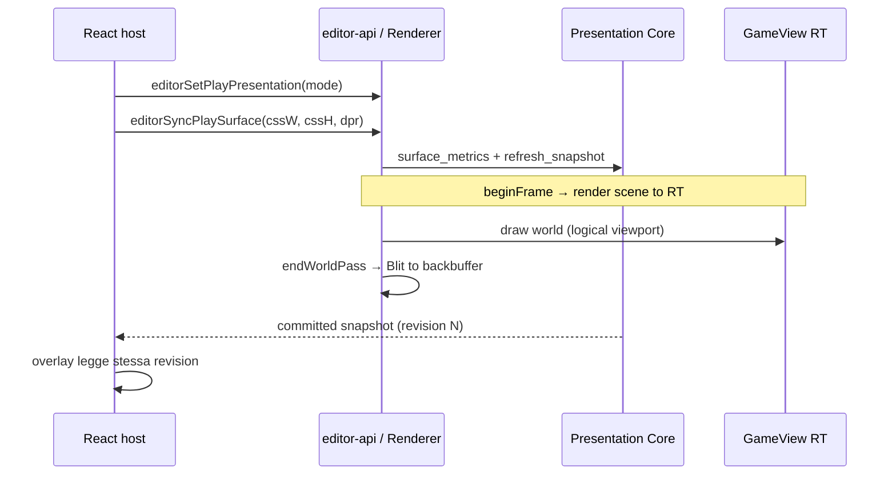

# Presentation Architecture — Report di migrazione e audit manuale

> **Audience:** collaboratori che devono fare code review / audit manuale  
> **ADR di riferimento:** [`PRESENTATION_ARCHITECTURE.md`](PRESENTATION_ARCHITECTURE.md)  
> **Stato migrazione:** fasi **1–8 implementate** · **ADR non dichiarato chiuso** (gap P0 sotto) · fase **9 non avviata**  
> **Ultimo commit codice rilevante:** `d6a04ea7` — fasi 7–8  
> **Addendum verifica codice:** 2026-06-24

**Indice rapido addendum:** [§ 13 Gap verificati](#13-addendum-post-audit--gap-verificati-nel-codice) · [§ 14 Checklist chiusura ADR](#14-checklist-chiusura-adr-p0--p1--p2)

---

## 1. Executive summary

ArtCade Studio separa **cosa mostrare** (Presentation Core) da **come disegnare** (Renderer). Prima della migrazione, logica di fit/letterbox, coordinate surface↔world e policy di viewport erano duplicate tra React, `Renderer` e `CameraManager`, con drift tra preview WASM, play docked, finestra esterna e exe nativo.

La migrazione in 8 fasi ha introdotto:

1. Un **core C++ di presentazione** (policy, mapper, snapshot atomica per frame).
2. **Un solo percorso di picking** (`PresentationSnapshot::surface_to_world`).
3. **Store React** che consuma la snapshot committata (niente più “verità” parallela in TS per fit/letterbox).
4. **Viewport editor a superficie fissa** (pan/zoom come intent WASM, senza scroll DOM).
5. **Pipeline di render esplicita** a pass (fase 7).
6. **Parità play** tra embedded, finestra esterna, fullscreen e nativo (fase 8).

**Comportamento visivo atteso:** in edit mode e in play “normale” l’utente non dovrebbe notare regressioni volute; l’unico cambiamento UX intenzionale della serie è la **fase 6** (niente scroll del mondo via DOM — pan/zoom sulla superficie fissa).

**Nota (addendum):** l’implementazione è **sostanzialmente corretta** e il modello architetturale è quello giusto, ma **non** soddisfa ancora tutti i criteri di successo ADR. Vedi [§ 13 Addendum post-audit](#13-addendum-post-audit--gap-verificati-nel-codice) prima di dichiarare la migrazione chiusa.

---

## 2. Perché questa architettura

### 2.1 Problema di partenza

| Sintomo | Causa radice |
|--------|----------------|
| Ruler / overlay React non allineati al canvas WASM | TS e C++ calcolavano fit/scale in modo indipendente |
| Picking errato ai bordi o con letterbox | `screenToWorld` duplicato in `Renderer` e `CameraManager` |
| Play docked vs finestra preview con scale diversa | `editor_sync_play_surface` impostava il framebuffer in pixel **logici** invece che sulla **superficie host** (CSS×DPR) |
| Refactor renderer rischioso | `editorCameraActive` e branch sparsi mescolavano policy e draw |

### 2.2 Regola d’oro (ADR)

> **Presentation** descrive *cosa* è la vista (mode, surface, placement, matrici).  
> **Renderer** esegue *come* disegnare (RT, draw queue, Raylib).  
> La **snapshot** non contiene istruzioni di draw né ordine dei pass — solo stato committato per il frame *N*.

### 2.3 Catena delle coordinate

```
DOM / CSS surface
      ↓ devicePixelRatio
Framebuffer (GPU / canvas backing store)
      ↓ output policy (fit, integer scale, letterbox)
Logical viewport (SceneDef.viewportSize)
      ↓ camera (EditorCamera o GameCamera)
World
```

Ogni conversione deve dichiarare esplicitamente spazio di partenza e arrivo. Vedi ADR § *Coordinate spaces*.

---

## 3. Cronologia commit (fasi 1–8)

| Fase | Commit | Sintesi |
|------|--------|---------|
| 1–3 | `9ac56d97` | Presentation Core: policy, mapper, snapshot, dual camera, rimozione `editorCameraActive` |
| 4 | `3ee5eb42` | Picking solo via Presentation; rimossi `screenToWorld` duplicati |
| 5 | `123a695a` | Snapshot 64-byte verso React; `usePresentationSnapshot()`; fit TS demoted |
| 6 | `e45ed413` | Superficie fissa; `editor_resize_surface` + ViewController; niente scroll spacer |
| 7 (base) | `9f9fef59` | Pass espliciti in `app/render/passes/`; `RenderPipelineBuilder` |
| 7–8 (chiusura) | `d6a04ea7` | `buildPipeline` ADR, dedupe sprite, mode-driven passes, play surface unificata, `PlayExternal`/`PlayFullscreen` |

---

## 4. Fase 7 — Pipeline a pass espliciti

### 4.1 Obiettivo ADR

> *Explicit passes: Scene, GameView, Blit, Grid, Gizmo, Debug* — cambiamento **strutturale**, non necessariamente visivo.

### 4.2 Cosa è stato fatto

#### A) Modello dati pipeline (`runtime-cpp/src/modules/renderer/`)

| Simbolo | File | Ruolo |
|---------|------|--------|
| `RenderPassId` | `include/render_pass_id.h` | Enum dei pass: `SceneBackdrop`, `Grid`, `SceneEntities`, `Gizmo`, `Debug`, `GameView`, `Blit` |
| `ViewRenderFeatures` | `include/view_render_features.h` | Flag opzionali: grid, gizmo, selection, physics debug, `drawCameraFrame` (solo React) |
| `RenderPipeline` | `include/render_pipeline.h` | `appPassOrder` + flag `captureGameView` / `blitGameView` |
| `RenderPipelineBuilder::buildPipeline` | `src/render_pipeline.cpp` | Costruisce il piano da **snapshot + features + scene attiva** |

**Perché `buildPipeline` e non solo un vettore di pass:** l’ADR mostra `buildPipeline(snapshot, features)` come API canonica. I flag GameView/Blit documentano il ciclo completo anche se l’esecuzione resta nel `Renderer` (vedi sotto).

#### B) Scheduling guidato dalla presentation mode

In `render_pipeline.cpp`, la snapshot **non è ignorata**:

- **Overlay editor** (Grid, Gizmo): solo se `effectiveMode` è `SceneEdit` o `CameraPreview`.
- **GameView + Blit**: flag attivi per `PlayEmbedded`, `PlayExternal`, `PlayFullscreen`.

Questo evita di mostrare gizmo in play e allinea il piano render alla modalità committata.

#### C) Pass applicativi (`runtime-cpp/src/app/render/passes/`)

| Pass | File | Contenuto |
|------|------|-----------|
| SceneBackdrop | `scene_background_pass.cpp` | Sfondo scena, parallax |
| Grid | `grid_pass.cpp` | Griglia editor |
| SceneEntities | `scene_entities_pass.cpp` | Entità, tilemap, testo |
| Gizmo | `gizmo_pass.cpp` | Selezione / handle |
| Debug | `debug_pass.cpp` | Physics debug (WASM play) |

**Perché sotto `app/render/` e non `renderer/passes/`:** i pass Grid/Gizmo/Debug sono overlay **editor/game app**, non primitivi del modulo renderer. Il modulo renderer espone solo infrastruttura (es. `BlitPass` in `renderer/src/passes/blit_pass.cpp`).

#### D) Orchestrazione frame (`app_scene_render.cpp`)

Flusso per frame:

```
committedPresentationSnapshot()
        ↓
buildPipeline(snapshot, features, hasScene) → appPassOrder
        ↓
beginFrame()          ← GameView RT capture (se compositor attivo)
        ↓
for (pass in appPassOrder) → switch → execute_*_pass()
        ↓
endWorldPass()        ← Blit GameView → backbuffer (se compositor)
        ↓
endScreenPass() / presentScreen()
```

`GameView` e `Blit` nell’enum hanno `case` vuoti nel loop app: **sono eseguiti dentro** `Renderer::beginFrame` / `Renderer::endWorldPass` — scelta intenzionale per non duplicare il lifecycle Raylib/Emscripten.

#### E) Dedupe risoluzione sprite (`sprite_frame_resolve`)

Prima, `resolveSpriteFrame` era copiato in `scene_entities_pass.cpp` e `gizmo_pass.cpp`.

Ora modulo unico:

- `runtime-cpp/src/app/render/sprite_frame_resolve.h`
- `runtime-cpp/src/app/render/sprite_frame_resolve.cpp`

API: `sprite_frame_resolve()`, `sprite_frame_has_pixels()`.

**Perché:** una sola politica per “quale frame sprite disegnare” (clip corrente → defaultClip in edit → asset statico).

#### F) `drawCameraFrame` in `ViewRenderFeatures`

Presente per **parità con l’ADR**; il rettangolo camera in edit è disegnato in **React** (`PreviewPanel`), non in C++. Il builder C++ non schedula un pass dedicato — nessun debito nascosto: il flag esiste per contratto futuro / documentazione.

### 4.3 Cosa verificare in audit (fase 7)

- [ ] `buildPipeline` non schedula Grid/Gizmo in modalità play.
- [ ] `features.drawPhysicsDebug` rispettato solo dove previsto (`app_scene_render` + WASM).
- [ ] Nessun pass “fantasma”: ogni `RenderPassId` in `appPassOrder` ha `execute_*` corrispondente.
- [ ] `beginFrame`/`endWorldPass` rispettano `gameViewCompositorEnabled` coerente con `PresentationMode`.
- [ ] `sprite_frame_resolve` usato ovunque serviva risoluzione sprite (grep `resolveSpriteFrame` → deve essere zero).

### 4.4 Test automatici fase 7

| Test | Path |
|------|------|
| Pipeline builder | `runtime-cpp/tests/render_pipeline_test.cpp` |
| Presentation / camera modes | `runtime-cpp/tests/presentation-camera-modes-test.cpp` |
| Integrazione presentation | `runtime-cpp/tests/presentation-integration-test.cpp` |

---

## 5. Fase 8 — Parità play (embedded, external, fullscreen, native)

### 5.1 Obiettivo ADR

> *Same snapshot/policy for embedded play, external window, fullscreen, native exe*

Tutti i percorsi play devono:

1. Usare **GameCamera** + **output policy** del progetto.
2. Rasterizzare la scena in **GameView RT** (logical viewport).
3. Comporre sulla **superficie host** con la stessa policy (letterbox / integer fit).
4. Esporre la **stessa snapshot** a React per eventuali overlay.

### 5.2 Problema risolto

**Prima:** `editor_sync_play_surface(fbW, fbH)` impostava il backing store alla **risoluzione logica** della scena (es. 512×320). Il CSS applicava poi `transform: scale(...)` per riempire lo stage → framebuffer e area visiva non coincidevano con il modello compositor (letterbox gestito in C++).

**Dopo:** la superficie play è la **dimensione host in CSS**, moltiplicata per DPR nel core C++.

### 5.3 API C++ nuova / modificata

#### `Renderer::syncPlaySurface(cssW, cssH, devicePixelRatio)`

File: `runtime-cpp/src/modules/renderer/src/renderer.cpp`

Comportamento:

1. `fbW/H = round(css × DPR)` → `setWindowSize` se cambiato.
2. Aggiorna `PresentationState.surface` via `surface_metrics_from_css`.
3. `syncPresentationState()` → `updateCameraProjection()` → `refresh_snapshot()`.

Simmetrico concettualmente a `editorResizeSurface` (fase 6), ma **senza ViewController** — in play la camera è GameCamera, non editor pan/zoom.

#### `editor_sync_play_surface` (WASM export — **breaking change**)

| | Prima | Dopo |
|---|--------|------|
| Firma | `(int fbW, int fbH)` | `(float cssW, float cssH, float devicePixelRatio)` |
| Semantica | Pixel logici viewport | Pixel CSS area host × DPR |

Binding TS: `editor/src/utils/wasm-bridge.ts` → `editorSyncPlaySurface(cssW, cssH, dpr?)`.

#### `editor_set_play_presentation(int mode)` (WASM export — **nuovo**)

Ordinali allineati a `PresentationMode` (vedi `presentation-snapshot.ts` → `PRESENTATION_MODE_ABI`):

| Valore | Mode |
|--------|------|
| 2 | `PlayEmbedded` |
| 3 | `PlayExternal` |
| 4 | `PlayFullscreen` |

Stato WASM: `ArtCade::s_playPresentationMode` in `editor-api.cpp`, applicato su:

- `editor_set_mode(1)` (play)
- `editor_enter_play_mode`
- chiamata esplicita da React

Binding TS: `editorSetPlayPresentation('playEmbedded' | 'playExternal' | 'playFullscreen')`.

### 5.4 Percorsi React aggiornati

#### Play embedded (pannello preview docked)

File: `editor/src/panels/PreviewPanel.tsx`

- Canvas: `runtimeCanvasPlayStyle({ hostSize: playHostSize, ... })` — la canvas **riempie l’host** senza `scale()` CSS sulla logical size.
- Sync: `editorSyncPlaySurface(playHostSize.x, playHostSize.y, dpr)` quando cambia lo stage.
- Scale visiva per layout container: ancora derivata da snapshot (`playCssScaleFromSnapshot`) o fallback `playFitScale`.

#### Finestra runtime preview (Tauri)

File: `editor/src/runtime-preview/RuntimePreviewApp.tsx`

- All’avvio sessione: `editorSetPlayPresentation('playExternal')`.
- Resize / fullscreen: listener su `getCurrentWindow().onResized` + `isFullscreen()` → `playFullscreen` vs `playExternal`.
- Canvas: `runtimePreviewDisplaySize` → `hostSize` in `runtimeCanvasPlayStyle` (vedi `runtime-preview-display.ts`).

#### `runtime-sync-service`

Su `syncPlayMode(true)`: `editorSetPlayPresentation('playEmbedded')` prima di `editorSetMode(1)` — play nel main editor non eredita mode da sessione external precedente (istanze WASM separate, ma difesa esplicita).

### 5.5 Native exe

File: `runtime-cpp/src/app/src/app_project_lifecycle.cpp`

- Play: `ViewportPolicy::NativePlay` → compositor + `outputPolicy` da progetto.
- `setWindowSizeForLogicalViewport` per sizing finestra desktop.
- Fullscreen nativo: `Renderer::toggleBorderlessFullscreen()` imposta `PresentationMode::PlayFullscreen` (già presente pre-fase 8).

**Audit:** verificare che exe e WASM producano placement equivalente a parità di logical viewport, surface size e policy (test golden ADR §7).

### 5.6 Diagramma flusso play unificato



### 5.7 Cosa verificare in audit (fase 8)

- [ ] Docked play: `playHostSize` ≠ logical viewport quando c’è scale — sync deve usare **host**, non `frame.x/y` logici.
- [ ] External window: F11 fullscreen commuta `PlayFullscreen` nel WASM della finestra preview.
- [ ] DPR ≠ 1: framebuffer = round(css × dpr); picking usa snapshot aggiornata.
- [ ] Letterbox in play: disegnato dal compositor C++ (`blitGameViewToBackbuffer` + `OutputPlacement`), non da `transform: scale` sulla canvas logical.
- [ ] `editor_resize_surface` resta **edit-only** (`s_mode == 0`) — non confondere con play sync.
- [ ] Export WASM in `src/app/CMakeLists.txt` include `_editor_set_play_presentation`.

---

## 6. Mappa file per review manuale

### 6.1 C++ — Presentation & Renderer

| File | Focus audit |
|------|-------------|
| `runtime-cpp/src/modules/presentation/` | Snapshot, policy, mapper, ViewController |
| `runtime-cpp/src/modules/renderer/src/renderer.cpp` | `beginFrame`, `endWorldPass`, `syncPlaySurface`, `editorResizeSurface` |
| `runtime-cpp/src/modules/renderer/src/render_pipeline.cpp` | Scheduling pass vs mode |
| `runtime-cpp/src/modules/renderer/src/passes/blit_pass.cpp` | Blit RT → backbuffer |

### 6.2 C++ — App render loop

| File | Focus audit |
|------|-------------|
| `runtime-cpp/src/app/src/app_scene_render.cpp` | Loop pass, features, snapshot read |
| `runtime-cpp/src/app/render/passes/*.cpp` | Contenuto di ogni pass |
| `runtime-cpp/src/app/render/sprite_frame_resolve.*` | Dedupe sprite |
| `runtime-cpp/src/app/src/app_project_lifecycle.cpp` | Edit vs play policy, native |

### 6.3 C++ — WASM bridge

| File | Focus audit |
|------|-------------|
| `runtime-cpp/src/modules/editor-api/src/editor-api.cpp` | Export, `s_playPresentationMode`, sync surface |
| `runtime-cpp/src/modules/editor-api/include/editor-api.h` | Contratti export documentati |
| `runtime-cpp/src/app/CMakeLists.txt` | `GAME_EXPORTED_FUNCTIONS` |

### 6.4 TypeScript — Editor

| File | Focus audit |
|------|-------------|
| `editor/src/utils/presentation-snapshot.ts` | Parser ABI 64-byte, `PRESENTATION_MODE_ABI` |
| `editor/src/utils/wasm-bridge.ts` | `editorSyncPlaySurface`, `editorSetPlayPresentation` |
| `editor/src/utils/runtime-canvas-presentation.ts` | `hostSize` vs legacy scale path |
| `editor/src/panels/PreviewPanel.tsx` | Docked play layout + sync |
| `editor/src/runtime-preview/RuntimePreviewApp.tsx` | External / fullscreen |
| `editor/src/runtime-preview/runtime-preview-display.ts` | Display size da snapshot |
| `editor/src/utils/runtime-sync-service.ts` | `syncPlayMode` + embedded presentation |

---

## 7. Contratti pubblici toccati (attenzione breaking)

| Contratto | Cambiamento | Compat saved project |
|-----------|-------------|----------------------|
| `editor_sync_play_surface` | Firma 2 → 3 argomenti; semantica CSS×DPR | N/A (runtime editor) |
| `editor_set_play_presentation` | Nuovo export WASM | N/A |
| Snapshot WASM 64-byte | Stabile da fase 5 | N/A |
| Formato `.artcade` / `project.json` | Non modificato | ✅ |

Qualsiasi fork o branch che chiami ancora `editorSyncPlaySurface(logicalW, logicalH)` a **due argomenti** è **rotto** — aggiornare alle API in `wasm-bridge.ts`.

---

## 8. Come rieseguire verifiche

### 8.1 Test editor (TypeScript)

```powershell
cd editor
npm test -- --run
```

Suite rilevanti:

- `runtime-preview-display.test.ts`
- `RuntimePreviewApp.dom.test.tsx`
- `runtime-sync-service.test.ts`
- Test preview / canvas layout sotto `panels/preview/`

### 8.2 Build WASM

```powershell
cd runtime-cpp
.\build_wasm.bat
```

Verificare assenza errori link su `_editor_set_play_presentation`.

### 8.3 Test C++ (se build native tests disponibile)

```powershell
cd runtime-cpp\build
cmake --build . --config Release
.\tests\Release\render_pipeline_test.exe
```

### 8.4 Smoke manuale consigliato

| Scenario | Passi | Esito atteso |
|----------|-------|--------------|
| Edit pan/zoom | Apri scena, pan rotella, resize pannello | Nessun scroll DOM; camera stabile su resize |
| Play docked | Play nel pannello | Integer fit; niente blur da doppio scale CSS+WASM |
| Play external | Play su Tauri → finestra separata | Stessa policy; `PlayExternal` in snapshot |
| Fullscreen F11 | In finestra preview | `PlayFullscreen`; resize riempie schermo |
| Picking edit | Click entity ai bordi viewport | Allineato a snapshot revision |
| Native exe | `game.exe` con progetto | Compositor + window scale coerenti |

---

## 9. Criteri di successo ADR vs stato attuale

Riferimento: [`PRESENTATION_ARCHITECTURE.md` § Success criteria](PRESENTATION_ARCHITECTURE.md)

| Criterio | Stato | Note audit |
|----------|-------|------------|
| Zero fit/letterbox math in `editor/src` (eccetto consumo snapshot) | **Non chiuso** | `playFitScale` ancora fallback se `revision === 0` (`PreviewPanel`, `runtime-preview-display.ts`) |
| `Renderer` senza `editorCameraActive` | **Fatto** | Verificare assenza grep |
| Un solo `screenToWorld`: snapshot | **Fatto** | `editor_surface_to_world` |
| React rulers/overlay: un store, una revision | **Parziale** | Store ok; polling React ignora aggiornamenti placement con **stessa revision** (§ 13.1) |
| Snapshot atomica per frame (ADR) | **Non chiuso** | `refresh_snapshot()` committa fuori da `begin_frame()` (§ 13.1) |
| Play paths condividono `buildPipeline(snapshot, features)` | **Fatto** | Stesso builder; mode da snapshot |
| Shake in effective camera (draw = picking) | **Non chiuso** | Picking usa `noShake` in compositor play (§ 13.7) |
| Golden tests tutte policy e DPR≠1 + parità WASM/native exe | **Parziale** | Golden DPR/letterbox sì; `test_native_wasm_parity` = legacy vs nuovo math, non cross-target (§ 13.9) |

---

## 10. Fuori scope / fase 9

**Non implementato (volutamente):**

- Render graph generico (multi-RT, post-FX, split screen, minimap).
- Spostamento pass Grid/Gizmo nel modulo `renderer/` (restano app-layer).
- Rimozione completa di `playFitScale` TS finché non c’è garanzia snapshot sempre `revision > 0` al boot.

Attivare fase 9 solo con requisito prodotto esplicito (ADR: *Only when needed*).

---

## 11. Checklist audit rapida (stampabile)

Checklist **esplorativa** (fasi 1–8 già mergeate). Per la chiusura ADR usare la [§ 14 Checklist chiusura ADR](#14-checklist-chiusura-adr-p0--p1--p2).

```
□ Ho letto PRESENTATION_ARCHITECTURE.md (almeno § snapshot, modes, migration table)
□ Ho letto § 13 Addendum di questo report
□ Ho verificato buildPipeline vs effectiveMode su branch play e edit
□ Ho verificato syncPlaySurface(css, css, dpr) su docked + external
□ Ho verificato che nessun codice chiami editor_sync_play_surface a 2 argomenti
□ Ho grep-pato screenToWorld / editorCameraActive / playFitScale come sorgente di verità
□ Ho controllato GAME_EXPORTED_FUNCTIONS dopo modifiche editor-api
□ npm test --run verde
□ build_wasm.bat verde
□ Smoke manuale: edit resize, play docked, play external, F11
```

---

## 13. Addendum post-audit — gap verificati nel codice

> **Metodo:** review manuale del codice su `main` post-`d6a04ea7`, incrociata con osservazioni del team.  
> **Verdetto:** il refactor non è cosmetico; il modello centrale è corretto. L’ADR **non** va dichiarato chiuso finché i **P0** di § 14 non sono risolti o esplicitamente accettati con ticket.

### 13.1 Atomicità snapshot — **P0, gap confermato**

**Domanda architetturale:** `refresh_snapshot()` committa subito o prepara il frame successivo?

**Risposta nel codice:** committa **immediatamente** su `committedSnapshot_`, spesso **senza bump** di `revision`.

| API | File | Comportamento |
|-----|------|----------------|
| `begin_frame()` | `presentation_system.cpp` | `revision++`, ricalcola snapshot da `state_`, push history |
| `refresh_snapshot()` | `presentation_system.cpp` | Ricalcola da `state_`, **sovrascrive** `committedSnapshot_` con **stessa** `revision` (se `revision > 0`) |

Chiamate a `refresh_snapshot()` **fuori** dal confine frame, tra cui:

- `Renderer::Impl::updateCameraProjection()` (fine di ogni aggiornamento proiezione)
- `Renderer::editorResizeSurface()` / `Renderer::syncPlaySurface()`
- Path editor camera / view controller

Ordine in `Renderer::beginFrame()`:

1. `updateCameraProjection()` → `refresh_snapshot()` (stessa revision possibile)
2. `presentation.begin_frame()` → nuova revision

**Modello attuale (reale):**

```
mutate PresentationState
  → refresh_snapshot()     // committed aggiornata subito, revision spesso invariata
  → [render / picking / poll React]
begin_frame()              // nuova revision solo all'inizio del draw successivo
```

**Modello ADR (target):**

```
resize / intent → mutate pendingState + markDirty
begin_frame()   → committed = calculate(pending); revision++
// durante il frame N: renderer, picking, overlay usano solo committed(N)
```

**Drift osservabile:**

| Consumer | Cosa legge | Rischio |
|----------|------------|---------|
| C++ picking (`editor-input-controller`, `editor_surface_to_world`) | `committed_snapshot()` sempre fresca | Coerente con C++ mid-frame |
| React (`runtime-sync-service` poll) | Pubblica **solo se `revision` cambia** | Placement nuovo + **stessa revision** → overlay React **stale** |

Riferimenti: `runtime-cpp/src/modules/presentation/src/presentation_system.cpp`, `editor/src/utils/runtime-sync-service.ts` (`pollPresentationSnapshot`).

**Fix atteso:** `refresh_snapshot` → ricalcolo **pending** only; unica commit in `begin_frame`; notifica React su ogni commit (o bump revision su ogni cambio placement significativo).

---

### 13.2 Pipeline a pass — **P2, debito controllato**

`RenderPassId::GameView` e `::Blit` esistono ma il loop in `app_scene_render.cpp` ha `case` vuoti; capture/blit restano in:

- `Renderer::beginFrame()` — GameView RT
- `Renderer::endWorldPass()` — `RenderPasses::blit_game_view`

**Formulazione corretta fase 7:**

> Pass applicativi espliciti; lifecycle GameView/Blit ancora **renderer-owned**.

Non richiede render graph generico (fase 9). Miglioramento futuro: `pipeline.execute(BlitPass)` con primitive renderer per open/close target.

---

### 13.3 `playFitScale` — **P0, seconda autorità layout**

Fallback attivo quando `presentationSnapshot.revision === 0n`:

- `editor/src/panels/PreviewPanel.tsx`
- `editor/src/runtime-preview/runtime-preview-display.ts`

Il poll React **salta** `revision === 0`, quindi al bootstrap TS può posizionare il canvas con `playFitScale` mentre C++ applica `OutputPolicy` al primo refresh → possibile **salto al primo frame**.

**Regola ADR target:** nessun fit/letterbox/placement in TypeScript, nemmeno come fallback.

**Fix atteso:** non mostrare superficie play finché `revision > 0` (loading surface), oppure init presentation C++ prima di rendere visibile il canvas.

---

### 13.4 ABI snapshot 64 byte — **P1, fragile**

`PresentationSnapshotWasm` (`presentation_snapshot_wasm.h`):

- `static_assert(sizeof == 64)` — buono per size drift
- **Manca** `abiVersion` / `byteSize` in header
- TS (`presentation-snapshot.ts`): parser senza guard su versione
- `PRESENTATION_MODE_ABI` duplicato manualmente rispetto a `PresentationMode` C++

**Rischio:** modifica field order in C++ compila ma corrompe letture TS.

**Fix atteso:** header ABI versionato; `static_assert` su size; throw TS se version/size non supportati; test o codegen condiviso per ordinali mode.

---

### 13.5 Input e `presentationRevision` — **P1, contratto indefinito**

ADR: `SurfacePointerEvent.presentationRevision`.

Codice attuale:

- `PresentationBindings::surface_to_world(system, revision, …)` + history 3 revision — **implementato**
- `editor-input-controller.cpp` → usa solo `committed_snapshot()`, **senza** revision evento
- Nessun campo revision negli eventi Emscripten verso il core

**Comportamento implicito:** sempre snapshot corrente. Accettabile solo se documentato e testato su resize/fullscreen ai bordi.

**Fix atteso:** portare revision nel payload input; core usa `find_snapshot(revision)` con fallback definito.

---

### 13.6 `syncPlaySurface` / DPR — **P1, direzione corretta**

Modello implementato (fase 8):

```
CSS host × DPR → framebuffer
logical viewport → GameView RT
OutputPolicy → placement sulla superficie
```

`syncPlaySurface` confronta `fbW/H` prima di `setWindowSize` — mitigazione loop ResizeObserver.

**Da verificare manualmente / test:** DPR 1.25, 1.5, 2.0; resize ripetuti; assenza oscillazione fbW/fbH.

File: `renderer.cpp` (`syncPlaySurface`), `presentation-surface-metrics-test.cpp` (unit DPR, non loop host).

---

### 13.7 Camera shake / modifiers — **P0, incoerenza draw vs picking**

In `syncPresentationState()` con compositor play:

```cpp
const CameraModifiers noShake{};
compose_effective_game_camera(state.gameCamera, noShake);  // picking
```

In `beginFrame()` draw:

```cpp
apply_game_modifiers_to_frame_camera(frameCamera, impl_->gameModifiers_);
```

**Mondo disegnato con shake; matrici snapshot/picking senza shake** → drift in play con `CameraManager` shake attivo.

**Fix atteso:** `state.gameModifiers` nella effective camera usata per `pickingCamera` e per le matrici in snapshot.

---

### 13.8 `drawCameraFrame` — **P1, odore contrattuale**

Presente in `ViewRenderFeatures`, **non** letto da `buildPipeline`. Overlay camera frame è React (`PreviewPanel`).

**Opzioni:** rimuovere il flag; oppure rinominare/documentare come hint frontend-only.

---

### 13.9 Parità native / WASM — **P0 test, P1 dimostrazione**

| Livello | Stato |
|---------|--------|
| Parità **architetturale** (compositor, mode, sync surface) | Raggiunta in struttura |
| Parità **dimostrata da test** | Incompleta |

`presentation-golden-test.cpp::test_native_wasm_parity()` confronta **legacy `compositor_layout` vs `output_placement_compute`** — non WASM vs `game.exe`.

**Matrice minima consigliata** (golden o integration):

| Mode | Logical | Surface | DPR | Policy |
|------|---------|---------|-----|--------|
| Embedded | 320×240 | 900×600 | 1 | IntegerFit |
| Embedded | 320×240 | 900×600 | 1.5 | IntegerFit |
| External | 512×320 | 1280×720 | 1 | SmoothFit |
| Fullscreen | 320×240 | 1920×1080 | 1 | IntegerFit |
| Native exe | 320×240 | 1920×1080 | 1 | IntegerFit |

Per ogni riga: `contentRect`, `clipRect`, `scale`, letterbox, round-trip `surfaceToWorld` / `worldToSurface` entro epsilon.

---

### 13.10 Riepilogo priorità

| ID | Priorità | Tema | Blocca chiusura ADR? |
|----|----------|------|----------------------|
| 13.1 | **P0** | Snapshot commit solo a `begin_frame` | Sì |
| 13.3 | **P0** | Eliminare `playFitScale` come layout authority | Sì |
| 13.7 | **P0** | Shake/modifiers in effective camera | Sì |
| 13.9 | **P0** | Golden matrix DPR / letterbox / cross-target | Sì (prove) |
| 13.4 | P1 | ABI versionata snapshot | Hardening |
| 13.5 | P1 | Revision su pointer events | Hardening |
| 13.6 | P1 | Test DPR frazionario + resize loop | Hardening |
| 13.8 | P1 | `drawCameraFrame` dead flag | Pulizia contratto |
| 13.2 | P2 | Blit nel pipeline executor | Debito controllato |

---

## 14. Checklist chiusura ADR (P0 · P1 · P2)

Usare questa checklist **dopo** la checklist esplorativa § 11. Ogni voce P0 deve essere **spuntata con PR + test** prima di aggiornare lo stato migrazione a “chiusa”.

### P0 — Obbligatori prima di “ADR chiuso”

#### P0-A · Contratto snapshot

```
□ presentation_system: resize/intent mutano solo pendingState (o state_ pre-commit)
□ Una sola path di commit: begin_frame() → committed + revision++
□ refresh_snapshot() rimosso o ridotto a pending-only (nessuna scrittura committed fuori begin_frame)
□ Renderer: updateCameraProjection / syncPlaySurface / editorResizeSurface non committano snapshot
□ React: overlay aggiornato su ogni commit (revision bump O hash placement O evento esplicito)
□ Test: resize mid-frame → picking e React stesso placement entro stesso revision semantics documentato
□ File review: presentation_system.cpp, renderer.cpp, runtime-sync-service.ts, presentation-store.ts
```

#### P0-B · Zero fit TypeScript

```
□ Nessun playFitScale / playDisplaySize usato per layout play quando canvas è visibile
□ PreviewPanel: gate UI se snapshot.revision === 0 (loading surface o canvas nascosto)
□ runtime-preview-display: stesso gate per finestra external
□ grep editor/src: playFitScale solo in test o @deprecated senza call site layout
□ Smoke: nessun salto dimensione al primo frame play docked + external
```

#### P0-C · Camera effective unificata

```
□ syncPresentationState: pickingCamera usa compose_effective_game_camera(gameCamera, gameModifiers)
□ Verificato: matrici snapshot = camera usata in beginFrame per draw (compositor play)
□ Test o smoke: shake attivo → picking allineato al draw
□ File review: renderer.cpp syncPresentationState, beginFrame, app_scene_render setGameCameraModifiers
```

#### P0-D · Golden / parità dimostrata

```
□ Matrice § 13.9 coperta da test C++ (almeno placement + round-trip picking)
□ Caso DPR 1.5 in integration (non solo surface_metrics unit)
□ Caso letterbox integer (320×240 in 1920×1080) in integration
□ Documentato cosa “native_wasm_parity” testa realmente (rename test se serve)
□ Opzionale ma raccomandato: un test che esegue stessi input su path Renderer WASM vs native
```

### P1 — Hardening contratto (subito dopo P0)

```
□ PresentationSnapshotWasm: abiVersion + byteSize; static_assert size
□ parsePresentationSnapshotWasm: throw su version/size mismatch
□ Ordinali PresentationMode: test statico C++ ↔ TS o tabella generata
□ SurfacePointerEvent (o equivalente): presentationRevision su input Emscripten
□ find_snapshot(revision) usato nel path input con fallback documentato
□ Test resize ripetuti + DPR 1.25 / 1.5 senza oscillazione fb dimension
□ drawCameraFrame: rimosso da ViewRenderFeatures O rinominato hint React-only in header
```

### P2 — Pulizia architetturale (non blocca chiusura)

```
□ Valutare BlitPass eseguito da pipeline executor (non solo beginFrame/endWorldPass)
□ Documentare in render_pipeline.h il debito “renderer-owned lifecycle” finché esiste
□ Fase 9 (render graph) resta fuori scope finché non c’è requisito prodotto
```

### Firma reviewer (opzionale)

| Reviewer | Data | P0 completi | Note |
|----------|------|-------------|------|
| | | □ | |
| | | □ | |

---

## 12. Contatti documentazione correlata

| Documento | Uso |
|-----------|-----|
| [`PRESENTATION_ARCHITECTURE.md`](PRESENTATION_ARCHITECTURE.md) | ADR canonico |
| [`REACT_WASM_PATTERN.md`](REACT_WASM_PATTERN.md) | Confini React ↔ WASM |
| [`ARCHITECTURE_INTEGRATION.md`](ARCHITECTURE_INTEGRATION.md) | Flusso PLAY/STOP |
| [`TECHNICAL_DEBT_REVIEW.md`](TECHNICAL_DEBT_REVIEW.md) | Debito renderer storico |

---

*Report + addendum § 13–14 per audit interno post-migrazione fasi 7–8. Per decisioni architetturali originali → ADR. Per discrepanze report/codice → **il codice vince**. Gap P0: non dichiarare migrazione chiusa finché § 14 P0 non è soddisfatta.*

---

## 15. Consolidation PR1–PR6 (2026-06-24)

| PR | Stato | Deliverable |
|----|-------|-------------|
| PR1 | ✅ | Selection ≠ camera; pan/zoom only via ViewController |
| PR2 | ✅ | `presentation_solver`, ABI v2 (96 B), `presentation-store`, `useEditorCameraView` |
| PR3 | ✅ | `EditorViewportController`, `presentation_state_sync`, navigation prepare/commit |
| PR4 | ✅ | `frame_selection` nativo, `editor_zoom_policy`, F-key framing |
| PR5 | ✅ | `editor-ruler-metrics.ts`; rimosso scroll legacy; `SurfacePointerEvent` + `editor_set_pointer_presentation_revision` |
| PR6 | ✅ | `presentation-golden-test` esteso (solver + DPR matrix); `presentation-golden.test.ts`; ADR success criteria aggiornati |

**DoD PR5:** `grep scrollToWorld editor/src` → zero call site.

**DoD PR6:** golden C++ (placement, letterbox, DPR 1/1.25/1.5/2, solver round-trip) + test TS (camera/ruler revision parity, frame vs selection).

**P1 aggiornati in codice:** `SurfacePointerEvent` (`surface_pointer_event.h` + TS), `PresentationSnapshotWasm` ABI version/size, `parsePresentationSnapshotWasm` strict parse.

**Aperto (fuori scope PR6):** `buildPipeline(snapshot, features)` cross-target native exe; P0 checklist §14 completa.
