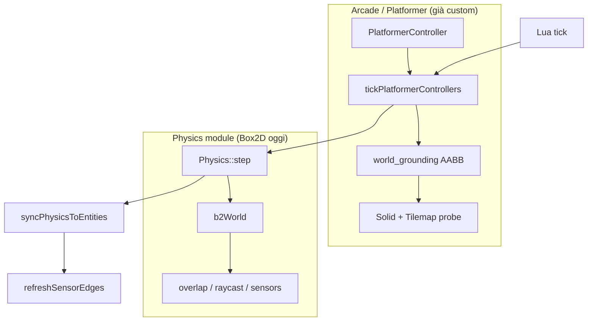
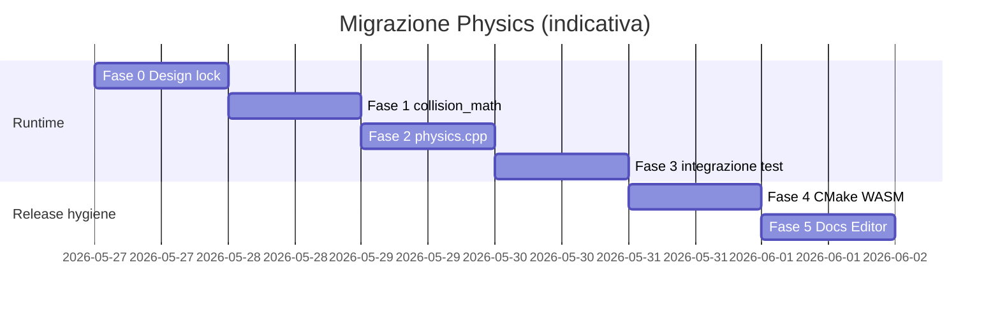

# Report tecnico — Migrazione Physics: rimozione Box2D e backend custom (Raymath / collisioni Raylib-style)

| Campo | Valore |
|--------|--------|
| **Progetto** | ArtCade Studio V2 |
| **Versione documento** | 1.0 |
| **Data** | 2026-05-27 |
| **Stato** | **Completato** su branch `feat/physics-no-box2d` (Fasi 1–5 + ripulitura doc) |
| **Audience** | Team C++, Editor/TS, QA, Product, Documentazione |
| **Autore** | Engineering (draft per review team) |

---

## 1. Executive summary

**Esito:** Box2D è stato **rimosso**. Il modulo `artcade-physics` usa un solver **custom** (`collision_math.h` + integrazione in `physics.cpp` con **Raymath**). Il **gameplay platformer** resta su **AABB custom** in `world_grounding.cpp`.

**Invariato:** facciata `physics.h`, binding Lua (`collision.*`, `physics.*`), ordine fixed-step (`docs/FIXED_STEP_CONTRACT.md`).

**Benefici:** niente FetchContent Box2D, WASM/link più leggeri, modello arcade coerente.

Le sezioni **3.x** descrivono lo **stato pre-migrazione** (riferimento storico). Per l’implementazione attuale vedere `runtime-cpp/src/modules/physics/`.

---

## 2. Motivazione

| Driver | Descrizione |
|--------|-------------|
| **Dimensione e build** | Box2D è scaricato a ogni configure via FetchContent; aumenta tempi CI e dimensione link (nativo + Emscripten). |
| **Allineamento architetturale** | Il piano “physics opzionale” (`docs/PHYSICS_OPTIONAL_INTEGRATION_PLAN.md`) tratta Box2D come layer per overlap/caduta oggetti, non come cuore del platformer. |
| **Determinismo** | Giochi arcade/scriptati beneficiano di integrazione esplicita e query geometriche prevedibili. |
| **Manutenzione** | Un solo stack matematico (Vec2 / Vector2 / Raymath) riduce il salto mentale tra `world_grounding` (AABB) e `physics.cpp` (Box2D). |

**Cosa non stiamo cercando:** un sostituto completo di Box2D (pile, joint, CCD, attrito realistico). Il prodotto ArtCade non li usa in gameplay oggi.

---

## 3. Stato pre-migrazione (storico — as-was)

### 3.1 Due layer di “fisica”



| Layer | Percorso principale | Ruolo |
|-------|---------------------|--------|
| **Movimento platformer** | `runtime-cpp/src/world/src/world_platformer_controller.cpp`, `world_movement.cpp`, `world_grounding.cpp` | Gravità scriptata (`customGravity`), salto, risoluzione AABB vs Solid/tilemap |
| **Physics module** | `runtime-cpp/src/modules/physics/` | Corpi Dynamic/Static/Kinematic, overlap, raycast, sensor fixture, tilemap static bodies |
| **Gateway** | `runtime-cpp/src/modules/runtime-entity-gateway/` | Policy body (`physics-body-rules.cpp`), handle → `destroyBody` su teardown EnTT |
| **Lua** | `runtime-cpp/src/modules/game-api/src/physics-api.cpp`, `entity-api.cpp` | `collision.*`, `physics.*`; sync transform ↔ body |

### 3.2 Ordine fixed-step (contratto runtime)

Da `runtime-cpp/src/app/src/app.cpp` (semplificato):

1. Lua `tick(dt)`
2. `tickPlatformerControllers(dt)` — **prima** di `physics.step`
3. `physics.step(dt)` se `physicsMode` è `On` o `Auto` con corpi attivi
4. `flushEntityQueues()`
5. `syncPhysicsToEntities()` — copia posizione body → Transform (solo entità con body; platformer senza body non è “pullato” da Box2D)
6. `refreshSensorEdges()` + dispatch eventi sensor a Lua

Questo ordine **non deve cambiare** nella migrazione.

### 3.3 Dipendenza Box2D (CMake)

- **FetchContent:** `runtime-cpp/src/modules/physics/CMakeLists.txt` → repo `erincatto/box2d` tag `v2.4.1`
- **Unico file con `#include <box2d/box2d.h>`:** `physics.cpp`
- **Consumatori di `artcade-physics`:** `artcade-app`, `artcade-world`, `artcade-runtime-entity-gateway`, `artcade-game-api`, test CTest

### 3.4 API `Physics` esposta oggi

File: `runtime-cpp/src/modules/physics/include/physics.h`

| Gruppo | Metodi |
|--------|--------|
| Mondo | `setGravity`, `step(dt, substeps)`, `hasActiveBodies` |
| Corpi | `createBody`, `destroyBody`, `destroyAllBodies`, `setBodyActive` |
| Sensori | `setSensorFixture`, `clearSensorFixture`, `addSensorFixture` (alias) |
| Stato | `setLinearVelocity`, `getLinearVelocity`, `setGravityScale`, `setPosition`, `getPosition` |
| Query | `areOverlapping`, `raycast`, `getContactingBodies` |

Coordinate: **Y-down** (screen space). Gravità default: `{0, +10}`.

### 3.5 Cosa Box2D fa *oggi* in pratica

| Feature | Implementazione Box2D | Uso gameplay |
|---------|----------------------|--------------|
| Caduta oggetti dynamic | `b2World::Step` | Crate, prove, test |
| Overlap coppia | `b2TestOverlap` | Lua `collision.overlap`, `touchingClass`, sensor edges |
| Raycast | `b2World::RayCast` | Lua `collision.raycast` |
| Point query | `QueryAABB` ±0.5px | Contatti al punto |
| Sensor extra shape | Seconda fixture | `onTriggerEnter` / `Exit` |
| Tilemap | `createBody(Static)` per cella | Collider statici + overlap; platformer usa AABB separato |
| Attrito / densità | Campi fixture | Quasi non usati nel gameplay attuale |
| Rotazione corpi | Sempre angolo **0** in `setPosition` | Nessun collider ruotato in sim |

### 3.6 Test e fixture

| Asset | Path |
|-------|------|
| Unit physics (15 casi) | `runtime-cpp/tests/physics-test.cpp` |
| Policy gateway (no sim) | `runtime-cpp/tests/physics-body-rules-test.cpp` |
| Integrazione world | `runtime-cpp/tests/world-intent-test.cpp` |
| Segnali entità / teardown body | `runtime-cpp/tests/entity-signals-test.cpp` |
| Fixture manuale | `runtime-cpp/test-project/fixtures/physics-baseline/` |
| Batch test | `runtime-cpp/run_runtime_core_tests.bat` |

### 3.7 Editor e Logic Board (riferimenti Box2D in UI)

Riferimenti testuali “Box2D” (da aggiornare in fase doc/UI, non bloccanti per C++):

- `editor/src/panels/inspector/component-registry.ts`
- `editor/src/panels/inspector/WorldSettingsSection.tsx`
- `editor/src/utils/logic-board/physics-trigger-capabilities.ts`
- `editor/src/types/index.ts`, `components.ts`

L’API Logic Board (`collision.*`, trigger `onCollision*`, `onTrigger*`) **resta**; cambia solo il backend runtime.

---

## 4. Proposta (to-be)

### 4.1 Principio: facciata stabile, backend riscritto

- **Invariato:** `physics.h`, handle `uint32_t`, `PhysicsComponent` / `Collider` in `types.h`, binding Lua, `PhysicsBodyRules`, fixed-step in `app.cpp`.
- **Riscritto:** solo `physics.cpp` (+ nuovo header di supporto, es. `collision_math.h`).
- **Rimosso:** FetchContent Box2D da `physics/CMakeLists.txt`.

### 4.2 Ruolo di Raymath vs Raylib

| Libreria | Cosa fornisce | Uso nella migrazione |
|----------|---------------|----------------------|
| **Raymath** | `Vector2` algebra, distanze, lerp, angoli | Integrazione movimento, normalizzazione direzioni raycast |
| **Raylib collision API** | `CheckCollisionRecs`, `CheckCollisionCircles`, `GetRayCollisionRec`, … | Opzionale se `ARTCADE_HAS_RAYLIB`; equivalente in `collision_math.h` per test headless |

**Nota per il team:** “Usare Raymath per la fisica” significa **fisica custom + math Raylib**, non sostituire Box2D con una chiamata a `raymath.h`.

### 4.3 Backend custom (comportamento target)

| Box2D oggi | Sostituto proposto |
|------------|-------------------|
| `b2World::Step` | Euler semi-implicito: `v += gravity * gravityScale * dt`, `p += v * dt` (solo `Dynamic`) |
| Static / Kinematic | Nessuna integrazione; posizione da `setPosition` / velocità da controller |
| Overlap | AABB vs AABB, circle vs circle, rect vs circle (angolo 0) |
| Raycast | Segmento vs forme; hit più vicino |
| Point query | Scan lineare o griglia spaziale leggera (N corpi tipicamente basso) |
| Sensor fixture | Seconda shape per handle; overlap senza risposta solida |
| `setGravityScale` | Moltiplicatore per body su gravità mondo |
| Densità / attrito | Ignorati o stub (comportamento attuale de facto) |

### 4.4 Strategia test headless

`physics-test` **non** linka Raylib oggi. Raccomandazione:

1. Implementare `collision_math.h` (header-only o .cpp dedicato) con le stesse regole geometriche di Raylib.
2. Opzionalmente, in build con Raylib, assert di parità su subset di casi (solo dev).

Non obbligatorio convertire `Vec2` → `Vector2` in tutto il runtime nella prima fase.

---

## 5. Impatto per ruolo

| Ruolo | Impatto | Azione |
|-------|---------|--------|
| **C++ runtime** | Alto — `physics.cpp`, CMake, possibili tweak tolleranze test | Implementazione + `run_runtime_core_tests.bat` |
| **C++ world/gateway** | Basso — commenti, nessun cambio API pubblica atteso | Review regressioni `world-intent-test` |
| **Lua / game-api** | Nessuno se facciata invariante | Smoke script con fixture physics-baseline |
| **Editor TS** | Basso — label e hint | Rinominare “Box2D” → “Physics collider” (copy **English**) |
| **Logic Board** | Nessuno su schema | Verificare warning `physics-trigger-capabilities` |
| **Docs** | Medio — ~15 file citano Box2D | Aggiornare architettura e roadmap dopo merge |
| **CI / build** | Positivo — meno FetchContent | Verificare pipeline WASM e nativo |
| **QA** | Medio | Checklist §8 |

---

## 6. Piano di implementazione (fasi)

| Fase | Deliverable | Criterio di uscita |
|------|-------------|-------------------|
| **0 — Design lock** | Questo report approvato; decisioni §10 chiuse | Team allineato su scope out |
| **1 — Collision core** | `collision_math.h`: overlap + raycast + point query | Unit test isolati (nuovi o estensione physics-test) |
| **2 — Physics backend** | `physics.cpp` senza Box2D; stessa API `physics.h` | `physics-test` 15/15 (tolleranze gravità documentate) |
| **3 — Integrazione** | Build nativo + WASM; nessun simbolo `b2*` | `world-intent-test`, `entity-signals-test` verdi |
| **4 — CMake cleanup** | Rimozione FetchContent box2d | Configure più veloce; link OK |
| **5 — Doc + UI** | README, TECHNICAL_OVERVIEW, inspector labels | Nessun riferimento fuorviante a Box2D come dipendenza attiva |

**Stima effort (1 dev familiar con il modulo):** 2–3 giorni C++ + test; 0.5 giorno editor/docs.



---

## 7. Compatibilità API (garanzie e non-garanzie)

### 7.1 Garanzie (obiettivo)

- Stesse firme C++ in `physics.h`.
- Stessi binding Lua: `collision.overlap`, `collision.touchingClass`, `collision.raycast`, `physics.createBody`, `physics.setGravity`, `physics.bodyPosition`, `physics.applyImpulse` / `applyForce` (comportamento attuale: **aggiunta diretta a velocità**, non impulso fisico).
- `physicsMode` (`off` / `auto` / `on`) e `hasActiveBodies()` invariati semanticamente.
- Platformer **senza** body Physics: comportamento identico (solo AABB grounding).
- Sensor enter/exit: stesso tick ordering post-`syncPhysicsToEntities`.

### 7.2 Non-garanzie (da comunicare)

| Area | Nota |
|------|------|
| Traiettoria caduta dynamic | Numeri leggermente diversi da Box2D (solver + substeps); test usano soglie conservative (`pos.y > 2` dopo 1s) |
| Tunneling | Corpi molto veloci possono attraversare sottili AABB; mitigazione: raycast (già in API) |
| Pile / stacking | Non supportato come Box2D; non usato in template attuali |
| Massa / impulso reale | Fuori scope salvo decisione esplicita post-migrazione |

---

## 8. Piano di test (QA)

### 8.1 Automatico

```powershell
cd runtime-cpp/build
cmake --build . --config Release
ctest -C Release --output-on-failure
# oppure
cd runtime-cpp
.\run_runtime_core_tests.bat
```

Test obbligatori verdi:

- `physics_test`
- `physics_body_rules_test`
- `entity_signals_test`
- `world_intent_test`

### 8.2 Editor (manuale)

Fixture: `runtime-cpp/test-project/fixtures/physics-baseline/`

- [ ] Progetto con `physicsMode: auto` — nessun costo se zero corpi
- [ ] Player platformer **senza** Physics: movimento + Solid/tilemap OK
- [ ] Player **con** Physics kinematic: `onCollision*` / overlap Logic Board
- [ ] Zona Sensor: `onTriggerEnter` / `Exit`
- [ ] Oggetto Dynamic che cade
- [ ] Preview WASM (Tauri) — dimensione bundle e assenza errori link

### 8.3 Regressione Logic Board

```powershell
cd editor
npm test -- --run
```

Focus: compiler collision triggers, `physics-trigger-capabilities` warnings.

---

## 9. Rischi e mitigazioni

| Rischio | Probabilità | Impatto | Mitigazione |
|---------|-------------|---------|-------------|
| Regressioni overlap sensor | Media | Alto | Test 13–14 in physics-test; world-intent sensor cases |
| WASM link rotto | Bassa | Alto | Build Emscripten in CI / `build_wasm.bat` post-merge |
| Progetti salvati | Basso | Basso | Nessun cambio schema JSON componenti |
| Aspettative “fisica realistica” | Media | Medio | Comunicazione prodotto + doc; label editor chiare |
| Duplicazione AABB (grounding vs physics) | Nota strutturale | Medio | Già accettato nel piano physics opzionale; unificazione futura opzionale |

---

## 10. Decisioni aperte (per review team)

| # | Domanda | Opzioni | Raccomandazione |
|---|---------|---------|-----------------|
| D1 | Test headless: solo `collision_math.h` o anche link Raylib in `artcade-physics`? | A) math puro B) Raylib quando disponibile | **A** per CI veloce |
| D2 | Unificare `Vec2` con `Vector2` Raymath a lungo termine? | Sì / No / Fase 2 | **Fase 2** — non bloccare migrazione |
| D3 | `applyImpulse` / `applyForce`: documentare hack o introdurre massa? | Doc / Massa fissa | **Doc** in v1 |
| D4 | Broadphase | Lineare vs griglia | **Lineare** finché corpi < ~200 |
| D5 | Branch strategy | Feature branch `feat/physics-no-box2d` | Feature branch + PR unica runtime |

---

## 11. Inventario file (checklist modifica)

### 11.1 Obbligatori (runtime)

| File | Azione |
|------|--------|
| `runtime-cpp/src/modules/physics/src/physics.cpp` | Riscrittura completa |
| `runtime-cpp/src/modules/physics/include/physics.h` | Aggiornare commenti (rimuovere “Box2D”) |
| `runtime-cpp/src/modules/physics/CMakeLists.txt` | Rimuovere FetchContent |
| `runtime-cpp/src/modules/collision/include/collision_math.h` | Kernel condiviso World + Physics |

### 11.2 Verifica / possibili tweak

| File | Motivo |
|------|--------|
| `runtime-cpp/tests/physics-test.cpp` | Tolleranze gravità |
| `runtime-cpp/tests/world-intent-test.cpp` | Caduta / overlap |
| `runtime-cpp/tests/entity-signals-test.cpp` | Teardown body |
| `runtime-cpp/src/world/src/world_tilemap.cpp` | Static bodies API invariata |
| `runtime-cpp/src/modules/game-api/src/physics-api.cpp` | Solo commenti |

### 11.3 Documentazione (post-merge)

- `docs/PHYSICS_OPTIONAL_INTEGRATION_PLAN.md`
- `docs/GLOBAL_LOGIC_UI_ARCHITECTURE.md`
- `docs/TECHNICAL_OVERVIEW.md`, `docs/ARCHITETTURA_TECNICA_ENGINE_2D.md`
- `README.md`, `CLAUDE.md`, `AGENTS.md`, `ROADMAP_INTEGRATIVA.md`

### 11.4 Editor (copy)

- `editor/src/panels/inspector/component-registry.ts`
- `editor/src/panels/inspector/WorldSettingsSection.tsx`
- `editor/src/utils/logic-board/physics-trigger-capabilities.ts`

---

## 12. Riferimenti interni

| Documento | Contenuto |
|-----------|-----------|
| `docs/PHYSICS_OPTIONAL_INTEGRATION_PLAN.md` | Platformer kinematic vs physics opzionale |
| `docs/FIXED_STEP_CONTRACT.md` | Ordine tick e sensor |
| `docs/GLOBAL_LOGIC_UI_ARCHITECTURE.md` | Trigger collision / sensor |
| `docs/ECS_IMPLEMENTATION_GUIDE.md` | `PhysicsHandleComp` e teardown |
| `docs/LUA_GAME_API.md` | Contratto Lua collision / physics |
| `runtime-cpp/src/modules/physics/include/physics.h` | API C++ target |

---

## 13. Roadmap post-migrazione (physics refactor)

Incremental work after Box2D removal (see also [`PHYSICS_OPTIONAL_INTEGRATION_PLAN.md`](PHYSICS_OPTIONAL_INTEGRATION_PLAN.md) §13–14):

| Phase | Status | Summary |
|-------|--------|---------|
| 1 — Shared collision kernel | Done | `artcade-collision`; World + Physics use `collision_math.h` |
| 2 — Solver parity | Done | 4-pass resolve, resting contact, light CCD, `physics_test` 16–17 |
| 3 — Tilemap bodies | Done | Lazy build when no Dynamic; horizontal run merge |
| 4 — Platformer grounding | Done | Feet raycast probe in `world_grounding.cpp` |
| 5 — Scale | Done (baseline) | Uniform-grid broadphase when > 64 bodies |
| 6 — Docs | Done | `FIXED_STEP_CONTRACT`, integration plan, this report |

**Still optional later:** sensor-only tick without full `step`; stronger CCD tuning; remove tile bodies entirely (grid-only Lua collision).

---

## 14. Sintesi per decisione

| | |
|--|--|
| **Si fa?** | Sì, se l’obiettivo è engine arcade/scriptato con query collisionali, non simulazione rigid-body completa. |
| **Costo principale** | Riscrittura `physics.cpp` + validazione test integrazione. |
| **Costo evitato** | Riscrittura platformer, Logic Board schema, formato `.artcade`. |
| **Beneficio principale** | Meno dipendenze, WASM più leggero, modello fisico coerente con il prodotto. |
| **Prossimo passo** | Review team su §10 → approvazione Fase 0 → branch feature → Fase 1–3. |

---

## 15. Changelog documento

| Versione | Data | Modifiche |
|----------|------|-----------|
| 1.0 | 2026-05-27 | Prima emissione per distribuzione collaboratori |
| 1.1 | 2026-05-27 | Fase 5: label editor **Physics (Collider)** / **Sensor (Trigger Zone)**; doc GLOBAL_LOGIC, FIXED_STEP, README, TECHNICAL_OVERVIEW |
| 1.2 | 2026-05-27 | §13 roadmap post-migrazione (collision kernel, solver, tilemap, docs) |

---

*Per commenti o approvazione Fase 0, annotare decisioni D1–D5 e indicare owner C++ e QA sul task tracker del team.*
