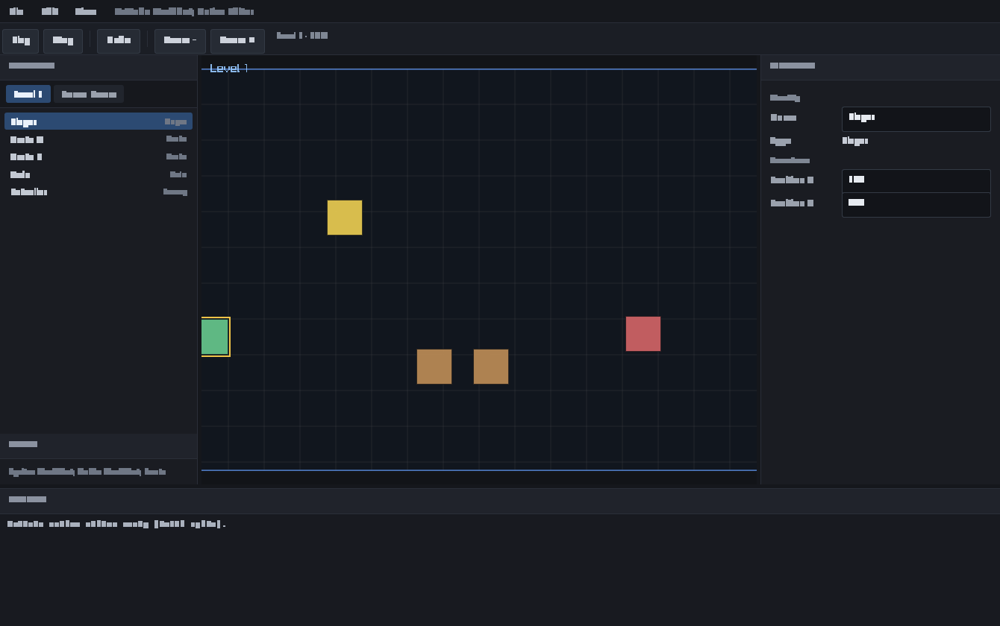

# RmlUi Native Editor — Spike Report

Companion to [`RMLUI_NATIVE_EDITOR_PLAN.md`](RMLUI_NATIVE_EDITOR_PLAN.md).
This reports what was actually built, verified, and learned.



*Live capture of `artcade-editor-native`: menu/toolbar, Hierarchy with scene
tabs + entity tree (Player selected), the real ArtCade scene rendered in the
viewport hole, the Inspector showing the selected entity's Position fields, and
the Console — all RmlUi, native, no WebView/WASM.*

---

## Verdict

**GO WITH CONDITIONS.**

The spike proves the thesis: a native C++ editor on RmlUi is simpler and
deterministic. The reference change is a straight line with one authority, no
serialization, no sync service, no polling, no fingerprint:

```
RmlUi NumberField "Position X"
  → EditorUi::Listener (one event listener)
  → commitInspectorPositionX()
  → EditorCoordinator::execute(SetEntityPositionCommand)
  → ProjectDocument (single authority)
  → EditorInvalidation::Inspector | Viewport
  → InspectorPanel::refresh + viewport next frame
```

This path is unit-tested in `artcade-editor-core` with spies proving no Replace,
no extra invalidation, and an exact undo (`tests/editor-core-test.cpp`, 61
checks green). The conditions for full GO are in
[Remaining work](#remaining-work-conditions-for-full-go).

---

## Commits produced

| Commit | Title |
| --- | --- |
| `1f94fde7` | Document RmlUi native editor architecture |
| `21abd429` | Add editor coordinator, commands, intents and invalidation |
| `afffa068` | Add RmlUi native editor host, shell and real viewport |
| _(this)_   | Add native-editor build scripts, third-party notices and report |

All on `main`, additive and gated; the web editor and existing runtime are
untouched.

## Files added / modified

- **Added:** `runtime-cpp/src/editor-native/**` (model, commands, app, ui, view,
  demo, resources), `runtime-cpp/tests/editor-core-test.cpp`,
  `runtime-cpp/build_native_editor.bat`, `runtime-cpp/run_native_editor.bat`,
  `THIRD_PARTY_NOTICES.md`, `licenses/RmlUi.txt`, `licenses/FreeType-FTL.txt`,
  `docs/RMLUI_NATIVE_EDITOR_PLAN.md`, `docs/RMLUI_NATIVE_EDITOR_REPORT.md`.
- **Modified (additive):** `runtime-cpp/CMakeLists.txt` (add editor-core lib +
  gated editor-native subdir), `runtime-cpp/tests/CMakeLists.txt` (register the
  core test).

---

## Actual architecture

Two layers split by dependency, which is also the line between *verifiable
logic* and *presentation*:

- `artcade-editor-core` (static lib, no Raylib/RmlUi):
  `ProjectDocument` (owns the canonical `ProjectDoc`), `EditorCommand` /
  `EditorIntent`, `EditorCoordinator`, `EditorInvalidation`, `SelectionState`,
  `EditorUiState`, `CommandStack`, `PlaySession`, `input_routing`,
  `inspector_commit`.
- `artcade-editor-native` (exe, opt-in): `RmlHost` / `RmlRenderer` /
  `RmlSystem`, `EditorApp`, `editor_input`, `SceneView`, `EditorUi` +
  `HierarchyPanel` / `InspectorPanel` / `ConsolePanel`, RML/RCSS resources.

### Modification flow (observed in code)

```
RmlUi Event (click / change / drag)
    ↓
EditorUi::Listener            (the single event entry point)
    ↓
EditorCoordinator
    ├── execute(EditorCommand)   → ProjectDocument        (authoring, undoable)
    └── apply(EditorIntent)      → SelectionState / EditorUiState (workspace)
    ↓
EditorOperationResult { ok, EditorInvalidation, error }
    ↓
EditorInvalidation (OR-accumulated, consumed once per frame)
    ├── Hierarchy → HierarchyPanel::refresh
    ├── Inspector → InspectorPanel::refresh
    ├── Console   → ConsolePanel::refresh
    ├── Toolbar   → toolbar status
    └── Viewport  → SceneView next frame
```

No `sync`, `poll`, `retry`, `readiness`, `replicate`, `fingerprint`, or
`reconcile` appears anywhere in this path. The words do not exist in the
editor-native source.

### RmlUi backend used

**Custom `Rml::RenderInterface` over raylib's `rlgl`** (plan Option 1, not the
sample GL3 backend). RmlUi compiled geometry is replayed with
`rlBegin(RL_TRIANGLES)` / `rlVertex2f` / `rlColor4ub`; textures (incl. FreeType
glyph atlases via `GenerateTexture`) are raylib `Texture2D`; clipping is
raylib's scissor. Result: **one window, one GL context, one GL loader
(raylib's)** — the second-GL-loader problem never arises.

### Raylib / OpenGL integration

raylib (5.0, desktop GL 3.3) owns the window and the frame. Each frame:
`BeginDrawing` → `ClearBackground` → `SceneView` draws the scene into the
viewport rect (scissored) → `RmlHost::render()` wraps `context_->Render()` in
`BeginBlendMode(BLEND_ALPHA_PREMULTIPLY)` (RmlUi vertices are premultiplied) →
`EndDrawing`. The viewport is a transparent RmlUi element, so the
pre-drawn scene shows through the "hole" while panels paint opaquely on top.
No nested `BeginDrawing`, no render-texture round trip (Option 3 not needed).

### Input routing

One pipeline (`editor_input::pumpRmlInput` → RmlUi first), then the viewport
receives input only when `shouldViewportReceiveInput(...)` is true: cursor in
the viewport rect, no RML text field focused, no popup. Pure predicate,
unit-tested.

### Ownership

`EditorApp` owns the window and `RmlHost`. `RmlHost` owns the RmlUi context,
interfaces, fonts and document. `EditorCoordinator` owns the one
`ProjectDocument`. Panels own only transient view state; `SceneView` reads the
document and owns nothing. `RmlUi` owns no project state.

### Observed performance

Smooth at the 60 FPS VSync cap on an RTX 3070 / GL 3.3; the editor is idle-light
because panels refresh only on invalidation and the normal frame does no
serialization or project scan. (No profiling harness was added — out of scope.)

---

## Deviations from the initial plan

**Authoring authority name.**
- Initial plan: introduce `ProjectDocument`.
- Evidence found: the repo already has a root data model, `struct ProjectDoc`
  (`runtime-cpp/src/core/types.h`).
- Decision: `ProjectDocument` is a thin class that **owns a `ProjectDoc`**,
  reusing the canonical model instead of duplicating it.
- Motivation: satisfies "one authority / no duplicate model" while reusing the
  exact engine type the runtime loads.
- Impact: none negative; the demo and any future loader produce a `ProjectDoc`.
- Tests added: `editor-core-test` §24.1/5/6/11 exercise it.

**Fonts loaded from the system, not bundled.**
- Initial plan implied bundled fonts under `resources/fonts/`.
- Evidence: shipping a TTF binary is out of scope for a spike and FreeType needs
  a real face.
- Decision: load `Segoe UI` / `Consolas` from `C:/Windows/Fonts` at runtime.
- Motivation: zero binary assets committed; immediate, legible rendering.
- Impact: Windows-only for now; documented in `THIRD_PARTY_NOTICES.md`.
- Tests added: none (presentation-only); covered by the runtime smoke capture.

**Phases bundled into fewer commits.**
- The plan listed commits 3–7 (host, shell, panels, viewport). They are
  interdependent and only build together, so they landed as one buildable commit
  (`afffa068`) to keep every commit compilable. No scope was dropped.

**Demo project instead of a loaded `.artcade`.**
- The viewport renders a `ProjectDoc` built in code (`demo/demo_project.cpp`) so
  the target stays lean (no asset pipeline / Lua / scene-system link). The data
  are the real authoring types; only the loader is stubbed.

---

## Remaining work (conditions for full GO)

Out of scope here, required before replacing the web editor:

1. **Project I/O**: load/save real `.artcade` into `ProjectDocument` (reuse the
   existing asset-system parser) instead of the demo project.
2. **Runtime projection wiring**: connect `ProjectDocument` → `SceneManager` /
   `RuntimeEntityGateway` via the existing Replace/Select/Patch verbs, and drive
   the real engine viewport (`FrameCoordinator` + `EditorOverlayRenderer`)
   instead of the lean raylib `SceneView`.
3. **Real Play/Stop**: have `PlaySession` drive a `replaceProject` + gameplay
   modules (the runtime already supports this).
4. **Inspector breadth**: components beyond Transform; selection in the viewport
   (picking, drag gizmo).
5. **Font hinting/crispness**: the system fonts render slightly soft at 13px;
   evaluate RmlUi font sizing / a bundled hinted family.
6. **Undo/redo UI**, multi-selection, tile painting, Logic Board — explicitly
   deferred (plan §9).

None of these threaten the architecture; they are additive against the proven
core.

## Debt introduced

- Windows-only system-font path (one function, clearly flagged).
- `SceneView` duplicates a little of `EditorOverlayRenderer`'s intent rather
  than reusing it — deliberate, to avoid linking the full render pipeline into
  the spike. Folding them together is item 2 above.
- No redo stack yet (undo only), per plan.

---

## Per-panel migration difficulty

| Panel / feature | Difficulty | Notes |
| --- | --- | --- |
| Toolbar / menu | **Easy** | static RML + a few `data-action` buttons |
| Console | **Easy** | append-only list from `consoleLog()` |
| Hierarchy + scene tabs | **Easy** | list build + select intents (done) |
| Inspector (Transform) | **Easy** | done; the headline path |
| Inspector (all components) | **Medium** | many typed rows; same command pattern |
| Splitters / layout | **Medium** | done for 3 splitters; docking is out of scope |
| Viewport (display) | **Medium** | done lean; reusing the engine pipeline is the work |
| Viewport (picking + gizmos) | **Hard** | hit-testing, drag math, multi-select |
| Logic Board | **Hard** | node graph; a separate effort |
| Asset browser + import | **Hard** | thumbnails, drag-drop, import pipeline |

---

## Naming review (plan §33)

New files describe responsibilities; no `manager`, `service`, `helper`, `utils`,
`common`, `bridge`, `sync`, or `handler` in any new filename or class.

- `rml_` prefix only on the three genuinely RmlUi-bound files: `rml_host`,
  `rml_renderer`, `rml_system`. Panels are toolkit-neutral
  (`hierarchy_panel`, `inspector_panel`, `console_panel`).
- File ↔ class correspondence holds (`editor_coordinator.* → EditorCoordinator`,
  `scene_view.* → SceneView`, `project_document.* → ProjectDocument`, …).
- One deliberate generic term remains: `EditorCoordinator` — the prompt's own
  name for the single coordinator (§5), justified and singular.
- No name encodes the migration ("V2", "New", "RmlUiVersion", …).

---

## Acceptance criteria (plan §8 / prompt §27)

Verified now: compiles from clean (RmlUi/FreeType fetched); native window opens;
RmlUi renders the shell; layout is professional; viewport shows a real ArtCade
scene; clean shutdown; no WebView2 / WASM / JSON bridge / sync service; scene
change is an intent (no reload); inspector edit is a command (no full replace);
command/intent split; the Position X path is linear and unit-tested; splitter
clamp; input-routing predicate. DPI scaling and live resize are wired
(`SetDensityIndependentPixelRatio`, `IsWindowResized → host.resize`); the three
splitters drag via `ResizePanelIntent`.
